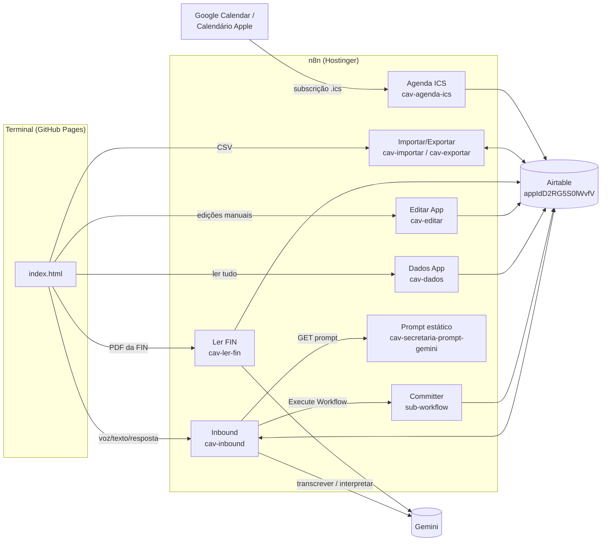
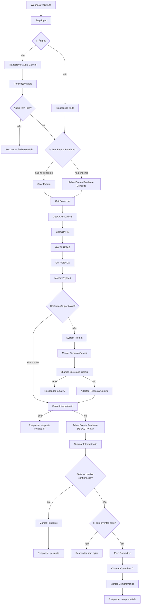
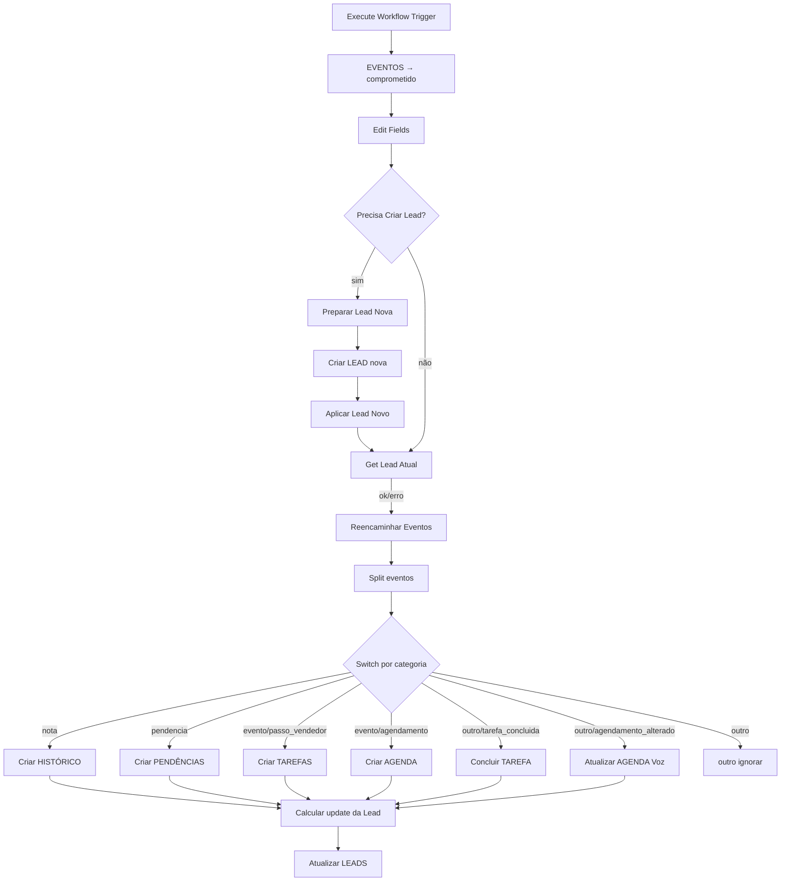
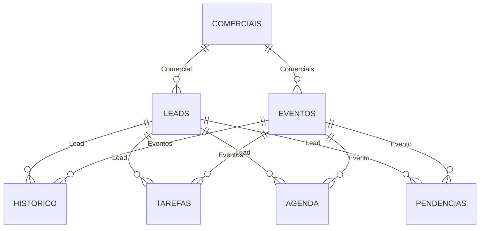
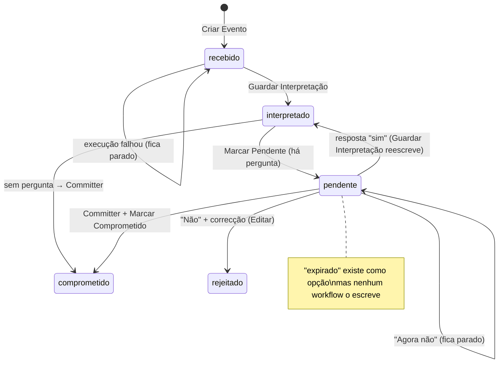

# CAV — Arquitectura técnica completa

> Documento de referência, escrito a 29/09/2026 a partir **apenas** do que está no repositório
> (`index.html`, `workflows/*.json`, `scripts/*.mjs`, `CLAUDE.md`, `README.md`, `CONFIGURAR.md`) e do
> `git log`. Não se consultou o n8n nem o Airtable. Onde algo não é dedutível dos ficheiros, está
> escrito **"não dedutível do repositório"** em vez de uma suposição.
>
> Serve de base a uma segunda versão, simples e visual. Os nomes de nós, campos, tabelas e acções
> estão escritos **exactamente** como aparecem nos ficheiros (incluindo erros ortográficos e
> acentos), para se poderem procurar.
>
> Os exemplos de pessoas, telefones e emails são **inventados**.

---

## Índice

1. [Visão geral](#1-visão-geral)
2. [Terminal (`index.html`)](#2-terminal-indexhtml)
3. [Workflows do n8n, um a um](#3-workflows-do-n8n-um-a-um)
4. [O prompt da Secretária](#4-o-prompt-da-secretária)
5. [Modelo de dados no Airtable](#5-modelo-de-dados-no-airtable)
6. [Funcionalidades de ponta a ponta](#6-funcionalidades-de-ponta-a-ponta)
7. [Custos e quotas](#7-custos-e-quotas)
8. [Operação](#8-operação)
9. [Problemas conhecidos e pendentes](#9-problemas-conhecidos-e-pendentes)
10. [Glossário](#10-glossário)
11. [Anexo A — Contratos JSON entre as peças](#11-anexo-a--contratos-json-entre-as-peças)
12. [Anexo B — Histórico do projecto (git log resumido)](#12-anexo-b--histórico-do-projecto-git-log-resumido)

---

## 1. Visão geral

### 1.1 O que é

O CAV é o sistema de trabalho dos comerciais de uma agência de intermediação de crédito à
habitação. O comercial **fala ou escreve** o que aconteceu com um cliente ("liguei à Ana Costa, ficou
de me mandar o IRS até sexta"); uma IA (a **Secretária**, que corre no Gemini) transforma isso em
registos estruturados; o comercial **confirma** num cartão; só então o **Committer** escreve no
Airtable.

A regra de ouro do desenho é **confirm-first**: nada interpretado pela IA chega ao Airtable sem o
"sim" do comercial.

### 1.2 As peças

| Peça | Onde vive | No repositório | Papel |
|---|---|---|---|
| **Terminal** | GitHub Pages (`https://invisible-build.github.io/cav-terminal/`) | `index.html` (um só ficheiro, HTML+CSS+JS, ~2 240 linhas) | App web dos comerciais (telemóvel e desktop) |
| **Workflows** | n8n alojado na Hostinger | `workflows/*.json` (um JSON por workflow) + `workflows/INDICE.json` | Toda a lógica de servidor: webhooks, chamadas ao Gemini, escrita no Airtable |
| **Prompt da Secretária** | Dentro do workflow `FjelO9bMQh1Mr21I`, nó `Responder (Gemini v3.0)`, campo `parameters.responseBody` (~190 mil caracteres) | `workflows/cav-secretaria-prompt-estatico.FjelO9bMQh1Mr21I.json` | Instruções de sistema enviadas ao Gemini em cada chamada |
| **Gemini** | Google (`generativelanguage.googleapis.com`, modelo `gemini-3.6-flash`) | — | Transcrição de áudio, interpretação, leitura de FIN |
| **Dados** | Airtable, base `appIdD2RG5S0lWvfV` | fora do repositório, de propósito | Leads, eventos, histórico, tarefas, agenda, pendências, comerciais, configuração |
| **Scripts** | Mac do César / rotina na nuvem | `scripts/*.mjs` | Puxar/empurrar workflows, criar workflows, ler correcções |

> Nota: o `CLAUDE.md` e o `README.md` falam de `prompts/secretaria.md` e de uma pasta `terminal/`.
> **Nenhuma das duas existe**: `prompts/` tem só `.gitkeep`, e o Terminal é o `index.html` na raiz.
> O prompt vive apenas dentro do JSON do workflow.

### 1.3 Diagrama geral



### 1.4 Percurso de uma mensagem — passo a passo

#### A) Texto escrito, ou voz no browser (Chrome/Android/desktop)

1. O comercial toca no microfone (`micTap()`). Se o browser tem `SpeechRecognition` e **não é iOS**,
   o Terminal usa a Web Speech API (`lang='pt-PT'`, contínuo, resultados intermédios) e vai
   escrevendo na caixa `#micTxt`. Ao parar (`rec.onend`), chama `enviar()`.
   Se escrever em vez de falar, `Enter` ou o botão também chamam `enviar()`.
2. `enviar()` → `apiFalar({comercial_id, texto})` → `POST /webhook/cav-inbound`.
3. **Inbound** (`bSTGP7PErDam8WPE`):
   `Webhook (voz/texto)` → `Prep Input` (gera `ref` `EVT-AAAAMMDD-HHMMSS-XXX`) → `IF Áudio?` (falso)
   → `Transcrição (texto)` → `Já Tem Evento Pendente?` (verdadeiro: não há pendente) →
   `Criar Evento` (Eventos, `Estado: recebido`) → `Get Comercial` → `Get CANDIDATOS` → `Get CONFIG`
   → `Get TAREFAS` → `Get AGENDA` → `Montar Payload` (normaliza emails ditados, monta o bloco
   dinâmico) → `Confirmação por botão?` (falso) → `System Prompt` (vai buscar o prompt por HTTP) →
   `Montar Schema (Gemini)` → `Chamar Secretária (Gemini)` → `Adaptar Resposta (Gemini)` →
   `Parse Interpretação` → `Achar Evento Pendente` (nó **desactivado**, só deixa passar) →
   `Guardar Interpretação` (Eventos, `Estado: interpretado`, grava `interpretacao`) →
   `Gate — precisa confirmação?`.
4. Quase sempre há pergunta (o prompt obriga a pelo menos uma): `Marcar Pendente`
   (`Estado: pendente`, `pendente_desde`) → `Responder (pergunta)` devolve
   `{estado:'pergunta', pergunta, opcoes, transcricao, eventos, dominante, evento_id}`.
5. O Terminal abre o **cartão de confirmação** (`abrirSheet`): a pergunta, a frase dita, a lista de
   eventos (tipo + descrição) e os botões (`opcoes` do Gemini, ou "Sim, é isso"/"Não" por omissão)
   mais "Agora não".

#### B) Voz no iPhone (ou qualquer browser sem reconhecimento de voz)

1. No iOS o Terminal **nunca** usa a Web Speech API (pouco fiável e o fallback chegava tarde para
   contar como gesto do utilizador): vai directo a `gravarAudio()` com `MediaRecorder`
   (`audio/webm;codecs=opus`, `audio/webm` ou `audio/mp4`, o primeiro suportado).
2. Ao parar, se o blob tiver menos de 900 bytes mostra "Não apanhei nada."; senão converte para
   base64 e chama `enviar({audio_base64, audio_mime})`.
3. No Inbound, `IF Áudio?` (verdadeiro) → `Transcrever Áudio (Gemini)` — **chamada isolada**, com um
   system prompt curto e **sem** CANDIDATOS/VENDEDOR (para não haver por onde inventar) →
   `Transcrição (áudio)` → `Áudio Tem Fala?`.
   - Sem fala (resposta vazia ou exactamente `(sem fala percetível)`) → `Responder (áudio sem fala)`
     (`estado:'sem_acao'`, "Não percebi fala no áudio — tenta outra vez.").
   - Com fala → segue para `Já Tem Evento Pendente?` e daí igual ao caminho A.
4. Custo: áudio gasta **2 chamadas** Gemini (transcrição pequena + interpretação); texto gasta 1.

#### C) Confirmação por botão "Sim" — o atalho sem IA

1. O comercial carrega "Sim, é isso" → `responder('sim')` → `POST cav-inbound` com
   `{comercial_id, evento_pendente_id, evento_pendente:{dominante, transcricao_original, eventos}, resposta:'sim'}`.
2. Inbound: `Prep Input` (texto = resposta) → `IF Áudio?` (falso) → `Transcrição (texto)` →
   `Já Tem Evento Pendente?` (falso: há pendente) → `Achar Evento Pendente (Contexto)` (procura em
   Eventos pelo `Ref`) → `Get Comercial` → … → `Montar Payload` → **`Confirmação por botão?`**.
3. A condição é verdadeira se: existe `evento_pendente_id` **e** a resposta (minúsculas) é uma de
   `sim`, `sim, é isso`, `é isso`, `isso`, `confirmo`, `ok`, `certo`, `exacto`, `exato` **e** todos
   os eventos têm âncora resolvida (`lead_id`) ou `estado === 'nova'`.
4. Verdadeiro → salta directamente para `Parse Interpretação`, cujo bloco de topo ("ATALHO") detecta
   que `Adaptar Resposta (Gemini)` não correu e devolve os eventos do pendente tal como vieram, com
   `precisa_confirmacao:false`. **Não há chamada ao Gemini** (corta metade das chamadas).
5. `Guardar Interpretação` (reescreve a mesma interpretação — desperdício conhecido) →
   `Gate — precisa confirmação?` (falso) → `IF Tem eventos (auto)?` → `Prep Committer` →
   `Chamar Committer (C)` → `Marcar Comprometido` → `Responder (comprometido)`
   (`{estado:'comprometido', mensagem:'Registado com sucesso.', lead_id, eventos}`).
6. O Terminal mostra "Registado ✓" e faz `refresh()`.

Se a pergunta era aberta (ex.: "qual das Marias?" — âncora ambígua), a condição falha e a resposta
segue para o Gemini, que aplica o §3.4 do prompt (preenche a âncora, relê a transcrição original).
Para confirmar que o atalho funcionou: nessa execução **não** aparece o nó
`Chamar Secretária (Gemini)`.

#### D) Correcção — "Não"

1. No cartão, o botão cujo `valor` é `nao` não envia nada ao Inbound: chama `prepararCorrecao()`,
   que troca os botões por uma caixa "O que estava errado?" com "Voltar" e "Enviar".
2. "Enviar" → `apiEditar({acao:'registar_correcao', evento_pendente_id, correcao_comercial})` →
   **Editar (App)** → `Achar Evento (Correcao)` (Eventos por `Ref`) → `Registar Correcao` (PATCH:
   `correcao_comercial` + `Estado: rejeitado`).
3. Nada é escrito nas outras tabelas. O registo em Eventos fica com a transcrição, a interpretação
   errada e a explicação — é a matéria-prima da revisão semanal (§6.10).
4. "Agora não" só fecha o cartão: o Evento fica em `pendente` para sempre (ver §9).

> O prompt (§3.4) ainda descreve um "não" que chega ao modelo e devolve o lote com
> `dados.recusado: true`. Desde 23/09 o Terminal nunca envia "não" ao Inbound, por isso essa regra
> já não é exercitada.

#### E) Respostas possíveis do Inbound (o que o Terminal faz)

| `estado` | Vem de | Terminal (`tratarResposta`) |
|---|---|---|
| `pergunta` | `Responder (pergunta)` | abre o cartão, guarda o bilhete em `PEND` |
| `comprometido` | `Responder (comprometido)` | toast "Registado ✓" (usa `r.resumo`, que o Inbound não envia) + refresh |
| `sem_acao` | `Responder (sem ação)`, `Responder (falha IA)`, `Responder (resposta inválida IA)`, `Responder (áudio sem fala)` | toast com `r.mensagem` |
| `rejeitado` | nenhum nó devolve isto hoje | toast "Descartado." |
| outro | — | toast `r.mensagem` ou "Feito" |
| erro HTTP | nós que lançam excepção sem saída de erro (ex.: `Prep Input`, `Transcrição (texto)`, `Prep Committer`) | toast de erro |

---

## 2. Terminal (`index.html`)

### 2.1 Estrutura do ficheiro

| Linhas (aprox.) | Conteúdo |
|---|---|
| 1–11 | `<head>`: título "CAV — Terminal", favicon SVG inline, fontes Google (Plus Jakarta Sans, Instrument Serif, DM Mono) |
| 12–352 | CSS (tokens em `:root`, tema escuro fixo) |
| 356–681 | HTML: login, rail (desktop), topbar e tabbar (mobile), 7 vistas, dock do microfone, cartão de confirmação, painel da lead, 8 modais, toast |
| 683–2242 | JavaScript, em secções numeradas (1. Configuração … 11. Arranque) |

Não há build, dependências, nem framework: é HTML/JS puro.

### 2.2 Configuração e ligação ao n8n

`CFG_DEF` (guardado em `localStorage` sob `cav-cfg`, editável no modal **Definições**):

| Chave | Valor por omissão | Campo no modal |
|---|---|---|
| `base` | domínio do n8n na Hostinger (ver `CFG_DEF.base`) | URL base do n8n |
| `inbound` | `cav-inbound` | Caminho — entrada de voz |
| `dados` | `cav-dados` | Caminho — leitura de dados |
| `editar` | `cav-editar` | Caminho — edição directa |
| `ics` | `cav-agenda-ics` | Caminho — calendário (.ics) |
| `exportar` | `cav-exportar` | Caminho — exportar dados |
| `importar` | `cav-importar` | Caminho — importar dados |
| `fin` | `cav-ler-fin` | Caminho — ler FIN |
| `key` | `''` | Chave da app (opcional), enviada no cabeçalho `x-cav-key` |

URL final: `base + '/webhook/' + caminho`. Cabeçalhos: `Content-Type: application/json` e, se houver
chave, `x-cav-key`. **Nenhum workflow verifica `x-cav-key`** — o campo existe mas não protege nada.

### 2.3 Funções de API (como fala com o n8n)

| Função | Método e caminho | Corpo | Usada por |
|---|---|---|---|
| `apiDados()` | `POST cav-dados` | `{comercial_id}` | `refresh()` (arranque, depois de cada acção, botão ⟳) |
| `apiFalar(payload)` | `POST cav-inbound` | `{comercial_id, texto?, audio_base64?, audio_mime?}` ou, em resposta, `{comercial_id, evento_pendente_id, evento_pendente, resposta}` | `enviar()`, `responder()` |
| `apiEditar(payload)` | `POST cav-editar` | `{comercial_id, acao, …}` | todos os formulários manuais (ver 2.9) |
| `apiExportar()` | `GET cav-exportar` | — (sem cabeçalhos) | `exportarDados()` |
| `apiImportar(payload)` | `POST cav-importar` | `{comercial_id, leads[], historico[], dry_run}` | `importarPreview()`, `importarConfirmar()` |
| `apiFin(payload)` | `POST cav-ler-fin` | `{comercial_id, lead_id, banco, ficheiro(base64)}` | `carregarFin()` |

O link ICS não é chamado pelo Terminal: é construído em `abrirCalendario()` como
`url(CFG.ics)+'?comercial_id='+id` (e a versão `webcal://`).

Erros: `apiEditar`, `apiImportar` e `apiFin` tratam `ok:false` na resposta como erro;
`apiFalar` só trata HTTP não-2xx.

### 2.4 Estado global e identidade

- `S = {comerciais, leads, tarefas, agenda, pendencias, historico, estagios}` — tudo o que o
  `cav-dados` devolve.
- `EU` — o comercial escolhido. **Não há autenticação**: o ecrã de login lista os comerciais e
  qualquer pessoa escolhe um; a escolha fica em `localStorage` (`cav-eu`). "Sair" = clicar no chip
  com o nome (`logout()`).
- `PEND` — o bilhete da pergunta em curso; `OCUPADO` — trava acções concorrentes; `LEAD_ABERTA`;
  `CAL_MES`, `CAL_SEL` — mês e dia seleccionados na agenda.
- `S.estagios` vem de `config.estagios` do Dados (que o lê de `sequencia_estagios` na tabela CONFIG),
  senão `ESTAGIOS_FALLBACK` = `lead, aguarda_documentos, aguarda_decisao_banco, aprovado,
  proposta_enviada, aguarda_banco, escritura_marcada, fecho`.
- Rótulos (`NOME_ESTAGIO`): Lead, Documentos, Decisão banco, Aprovado, Proposta enviada, Aguarda
  banco, Escritura, Fecho, e `nutricao` → **"Fora do pipeline"** (era "Nutrição" até 29/09).
- Filtros de visibilidade no browser: `meusLeads()` = leads sem comercial ou do `EU`;
  `ativos()` = `meusLeads()` sem `nutricao` e sem `status==='saida'`; `minhasTarefas()` idem pela lead.

### 2.5 Navegação e separadores

Mobile (< 860 px): topbar + **tabbar** em baixo; arranca no separador **Falar**, e o dock do
microfone só aparece nesse separador. Desktop (≥ 860 px): **rail** lateral; arranca em **Hoje**, e o
dock aparece sempre em baixo.

| Separador (`id`) | Contador no ícone | Função de render | Conteúdo |
|---|---|---|---|
| **Falar** (`voz`) | — | nenhuma | Botão grande 🎙 (`#vozBtn`, 88 px, chama `micTap()`), "Fala ou escreve". No mobile o botão do dock cresce para 66 px. |
| **Hoje** (`hoje`) | tarefas abertas | `rHoje()` | 5 secções: **Em atraso** (tarefas com prazo passado), **Para hoje** (só se houver), **Próximos encontros** (agenda não cancelada dos próximos 7 dias), **À espera de terceiros** (pendências `aberta`), **Parados há mais de 10 dias** (leads activas com `ultimo_contacto` ≥ 10 dias, máx. 8) |
| **Pipeline** (`pipe`) | leads activas | `rPipe()` | Título com nº de leads e soma dos valores; botão "＋ Nova lead"; quadro kanban, uma coluna por estágio + coluna **"Fora do pipeline"** sempre no fim (mostra "N em Recuperar →" e "Larga aqui para tirar do pipeline"). Cartões `.mini` com nome, valor e dias desde o último contacto; arrastáveis. |
| **Tarefas** (`tarefas`) | tarefas abertas | `rTarefas()` | Abertas; Concluídas (últimas 20). Caixa ✓ alterna (`toggleTarefa`). |
| **Agenda** (`agenda`) | compromissos não cancelados | `rAgenda()` | Calendário mensal (grelha 6×7, começa ao domingo), até 3 chips por dia + "+N"; botões ‹ › Hoje ＋ 🔗; lista do dia seleccionado com "✎ Editar" e "Apagar"; arrastar um chip para outro dia reagenda. |
| **Recuperar** (`recuperar`) | recuperáveis cujo contacto já venceu | `rRecuperar()` | Leads em `nutricao`: "Recuperar" (ordenadas pelo próximo contacto) e "Perdidas" (passaram 6 meses ou saída definitiva, só consulta). Ver §6.9. |
| **Equipa** (`equipa`) | nº de comerciais | `rEquipa()` | Cartão por comercial: nº de leads fora de `nutricao`, soma dos valores, chip ativo/inativo. |

### 2.6 Painel da lead (`abrirLead(id)`)

Desliza da direita. Cabeçalho: avatar com iniciais, nome, estágio · telefone. Corpo, por ordem:

1. **Botões rápidos**: "🎙 Ditar nota" (§6.8), "↗ Ver no pipeline", e "↺ Tirar do pipeline" (ou
   "↺ Reactivar" se já está em `nutricao`).
2. **Ficha editável**: Estágio (inclui sempre "Fora do pipeline"), Valor da proposta (€), Telefone,
   Email (aviso âmbar "Sem email — não dá para enviar emails a esta lead." se vazio), Origem da lead
   (sugestões: Facebook Ads, Instagram, Google Ads, Site, Referência, Feira, Chamada fria, WhatsApp),
   Tipo (—/Transferência/Aquisição), "Último contacto: …". Botão "💾 Guardar alterações"
   (`guardarLead`): valida o email; se o estágio passa para `nutricao` abre o formulário de saída;
   se sai de `nutricao` faz reactivação; senão `editar_lead`.
3. **Cartão "Fora do pipeline"** (só em `nutricao`) — o mesmo cartão do separador Recuperar.
4. **Checklist de documentos** — se o estágio está em `FASES_CHECKLIST` (de `aguarda_documentos` a
   `escritura_marcada`) ou a lead já tem checklist. Ver 2.7.
5. **Propostas de banco** — se estágio `aguarda_decisao_banco` ou já há bancos registados. Ver 2.8.
6. **Adicionar anotação** — caixa de texto + "＋ Adicionar ao histórico" (`nota_manual`).
7. **Última nota** (se existir).
8. Secções **Tarefas**, **Pendências**, **Agenda** da lead (só as abertas/não canceladas).
9. **Histórico** — linha temporal, mais recente primeiro: data · `tipo_registo` e o texto (`nota` ou
   `registo`).

### 2.7 Cartão da checklist de documentos

- Lista-modelo `CHECKLIST_TEMPLATE` (13 itens), **igual em três sítios** (Terminal, `Montar Payload`
  do Inbound e `Calcular update da Lead` do Committer — têm de se manter iguais):

| Grupo (`categoria`) | Título no Terminal | Itens |
|---|---|---|
| `credito` | Documentos do cliente | CC / BI (todos os titulares) · Comprovativo de morada · Último IRS + nota de liquidação · 3 últimos recibos de vencimento · 3 últimos extractos bancários · Mapa de responsabilidades (Banco de Portugal) · Declaração da entidade patronal |
| `imovel` | Documentos do imóvel | Caderneta predial urbana · Certidão permanente do registo predial · Licença de utilização/habitação · Ficha técnica de habitação · Certificado energético · CPCV (se existir) |

- `checklistDe(l)` mostra **sempre** o modelo completo com o estado guardado por cima; itens guardados
  que não estão no modelo aparecem no fim (grupo "outros").
- **Regra das fases avançadas**: de `aprovado` em diante, um documento do cliente sem registo conta
  como `recebido` (o banco não aprova sem eles). Um "pendente" explícito é respeitado.
- `grupoDaFase`: `aguarda_documentos` e `aguarda_decisao_banco` → `credito`; restantes → `imovel`.
  O grupo da fase actual vem primeiro, com a etiqueta dourada **"fase actual"**; o outro tem letra
  mais pequena.
- Cada grupo: barra de progresso verde, "X de N recebidos · **faltam K**" (âmbar) ou
  "✓ Todos recebidos" (verde). Item recebido = caixa verde com ✓; em falta = caixa com borda âmbar.
- Clicar num item (`toggleChecklistItem`) alterna o estado e envia a **lista completa** em
  `atualizar_checklist`.

### 2.8 Cartão das propostas de banco, FIN e comparação

- Lista `LISTA_BANCOS` (sugestões): CGD, BCP / Millennium, Novo Banco, Santander, BPI, Montepio,
  Crédito Agrícola, Bankinter, Abanca, Banco CTT, UCI. Aceita qualquer nome; recusa duplicados
  (sem distinguir maiúsculas).
- Cada banco é um bloco com barra lateral colorida e: nome; **etiqueta de estado** colorida
  (Pedido âmbar / Aprovado verde / Recusado vermelho) com um `<select>` invisível por cima; 📎 para
  carregar a FIN (ou "⏳ a ler…"); ✕ para remover (pede confirmação, e avisa que o resumo da FIN
  também se perde).
- Qualquer alteração envia a lista completa (`atualizar_propostas_banco`).
- **Resumo da FIN** (`resumoFinHtml`), se `p.fin` existe:
  - Sem `resumo`: "O PDF ficou guardado, mas a IA não conseguiu ler a FIN. Volta a carregá-la com 📎."
  - Com resumo: três KPI grandes — **Prestação/mês**, **TAEG**, **MTIC** (MTIC e montante sem
    cêntimos); detalhe: Montante · Prazo (em anos se múltiplo de 12) · TAN; taxa (tipo, indexante,
    spread); seguros (tipo e custo/mês); comissões; vendas associadas; "Válida até …" (+ "· expirada"
    a vermelho se a validade já passou); notas em itálico; aviso "Resumo lido pela IA — confirma no
    PDF antes de enviar ao cliente." com link "📄 ver FIN" (o URL vem do campo de anexos `fins`,
    casado pelo `anexo_id`, porque os URLs do Airtable expiram).
- **Tabela comparativa** (`tabelaFinHtml`) quando há **2 ou mais** FIN lidas. Linhas: Total/mês
  (prestação + seguros), Prestação, TAEG, MTIC (estas 4 são "chave" e ganham ★ dourada no menor
  valor), depois Seguros/mês, TAN, Spread, Montante, Prazo, Taxa, Validade. Bancos recusados ou com
  FIN expirada ficam esbatidos e não contam para o melhor. Primeira coluna fixa ao deslizar.

### 2.9 Formulários, modais e acções manuais

| Modal / controlo | Abre com | Envia | Acção no Editar |
|---|---|---|---|
| **Definições** (`mCfg`) | ⚙ | — (só `localStorage`) | — |
| **Importar / exportar** (`mImportExport`) | botão no fim das Definições | ver §6.11 | (workflow Importar/Exportar) |
| **Tirar do pipeline** (`mSaida`) | arrastar para "Fora do pipeline", menu do estágio, botão do painel, "falta o motivo — indicar" | `{lead_id, fase_origem, motivo_saida, motivo_livre, data_dita, desfecho_proposto, data_saida, nota}` | `sair_pipeline` |
| **Reactivar lead** (`mReactivar`) | botão Reactivar, arrastar de "Fora do pipeline" para outra coluna, mudar o estágio no painel | `{lead_id, estagio, nota}` | `reactivar_lead` |
| **Novo/Editar evento** (`mEvento`) | ＋ na agenda, "＋ Adicionar evento neste dia", "✎ Editar" | `campos:{titulo, lead_id, quando, estado}` | `criar_evento` / `editar_evento` |
| Apagar evento | "Apagar" (com `confirm`) | `{evento_id}` | `apagar_evento` |
| Arrastar evento no calendário | drag de um chip | `{evento_id, campos:{quando}}` (mantém a hora) | `editar_evento` |
| **Nova lead** (`mNovaLead`) | "＋ Nova lead" no Pipeline | `campos:{nome, telefone, email, valor, origem_lead, tipo, estagio}` | `criar_lead` |
| Guardar ficha da lead | "💾 Guardar alterações" | `{lead_id, campos:{estagio, valor, telefone, email, origem_lead, tipo}}` | `editar_lead` |
| Arrastar lead no pipeline | drag de um `.mini` | `editar_lead` com **todos** os campos (se faltasse um, ficava vazio no Airtable) | `editar_lead` |
| Nota escrita / ditada | painel | `{lead_id, nota}` | `nota_manual` |
| Tarefa ✓ | caixa da tarefa | `{tarefa_id, estado:'concluida'|'aberta'}` | `concluir_tarefa` |
| Checklist | item | `{lead_id, checklist_documentos:[…]}` | `atualizar_checklist` |
| Bancos | adicionar/estado/remover | `{lead_id, propostas_banco:[…]}` | `atualizar_propostas_banco` |
| FIN | 📎 | `{lead_id, banco, ficheiro}` | (workflow Ler FIN) |
| Correcção | "Não" no cartão | `{evento_pendente_id, correcao_comercial}` | `registar_correcao` |
| **Sincronizar agenda** (`mCalendario`) | 🔗 na agenda | — | (workflow Agenda ICS) |

Validações no browser: email vazio é aceite, preenchido tem de bater em
`/^[^\s@]+@[^\s@]+\.[^\s@]{2,}$/`; FIN tem de ser PDF e ≤ 5 MB; nova lead exige nome; evento exige
título e data (hora por omissão 09:00).

A lista de estados sugerida no modal de evento é `agendado`, `confirmado`, `concluído`, `cancelado`,
mas o campo `estado` da Agenda no Airtable só tem `agendado`, `realizado`, `cancelado` (ver §9).

`Escape` fecha cartão, painel e os modais `mCfg`, `mEvento`, `mNovaLead`.

### 2.10 Arrastar (pipeline e calendário)

Implementação própria com Pointer Events (`setPointerCapture`), limiar de 6 px antes de começar,
"fantasma" (`.cal-ghost`) a seguir o dedo e realce da coluna/célula de destino (`.drop-on`). Os
cartões têm `touch-action:none; user-select:none; -webkit-touch-callout:none` — sem isto o telemóvel
interrompia o gesto (bug corrigido a 20/09).

Pipeline: largar em "Fora do pipeline" → `abrirSaida`; largar uma lead que estava fora noutra coluna →
`reactivar`; caso normal → actualização optimista + `editar_lead`, com reversão se falhar.

### 2.11 Transcrição de voz

| Situação | Mecanismo | Onde se transcreve |
|---|---|---|
| Browser com `SpeechRecognition` e não-iOS | Web Speech API, `pt-PT`, contínua | no browser; envia `texto` |
| iOS, ou SR indisponível, ou erro de SR (excepto "sem permissão") | `MediaRecorder` → base64 | no n8n, pelo Gemini (`Transcrever Áudio (Gemini)`) |
| "Ditar nota" no painel, com SR e não-iOS | Web Speech API | no browser; grava directo com `nota_manual` (sem IA) |
| "Ditar nota" no iOS | fecha o painel, vai a Falar, pré-escreve "Nota sobre <nome>: " | passa pela Secretária |

O comentário da secção 5 do JS ainda diz "manda para o Whisper no n8n" — o Whisper foi retirado a
21/09 (§12).

Mensagens de permissão: "Sem permissão para o microfone." / no iOS, instrução para ir a
Definições > Safari > este site > Microfone.

### 2.12 Regras de cores

Paleta (`:root`): fundo `--bg #08090d`, superfícies `--s1..--s3`, bordas `--border/--border2`,
`--gold/--gold2` (marca e destaque), `--blue`, `--green`, `--red`, `--orange`, `--purple`, texto
`--text` / `--text2` / `--text3`.

Comentário fixo no CSS (bloco "BANCOS E DOCUMENTOS"):

> Cada cor tem um significado fixo: **verde = positivo** (aprovado, recebido), **vermelho = negativo**
> (recusado, expirado), **âmbar = à espera** (pedido, em falta), **dourado = destaque** (melhor
> valor), **azul = links**. `--text3` não serve para texto que se tenha de ler (contraste 2:1).

Outras convenções: dourado também é a cor da marca, do botão principal e do separador activo;
vermelho marca tarefas/pendências em atraso (borda esquerda `.urg`) e o botão a gravar; chip "parado"
vermelho para leads sem contacto há ≥ 10 dias; no Recuperar a borda é âmbar se o contacto já venceu,
cinzenta se é futuro, e a linha "Faltam N dias para os 6 meses" fica vermelha a ≤ 30 dias. As cores
das colunas do pipeline e dos avatares vêm de uma paleta rotativa (`CORES`) sem significado.

---

## 3. Workflows do n8n, um a um

### 3.0 Inventário

Estado `active` lido do campo `active` de cada ficheiro (o `INDICE.json` está desactualizado — ver §9).

| Id | Nome | Ficheiro | Activo | Nós | Webhook | Estado real |
|---|---|---|---|---|---|---|
| `bSTGP7PErDam8WPE` | CAV — Workflow A · Inbound (FIX pendente - rascunho) | `cav-workflow-a-inbound-fix-pendente-rascunho…` | **sim** | 36 | `POST cav-inbound` | **produção** (apesar do nome "rascunho") |
| `7DoKXQGDJH4yivLK` | CAV - Committer | `cav-committer…` | **sim** | 21 | — (sub-workflow) | **produção** |
| `GkeYwd5Aeo8pNa4d` | CAV · Dados (App) | `cav-dados-app…` | **sim** | 10 | `POST cav-dados` | **produção** |
| `mB8vJf3BawHaWEap` | CAV · Editar (App) | `cav-editar-app…` | **sim** | 17 | `POST cav-editar` | **produção** |
| `etno1VQ31Bj7nMi2` | CAV · Ler FIN | `cav-ler-fin…` | **sim** | 12 | `POST cav-ler-fin` | **produção** |
| `bfqFPe5fuxzbJX6t` | CAV · Agenda (ICS) | `cav-agenda-ics…` | **sim** | 5 | `GET cav-agenda-ics` | **produção** |
| `VPCgg9cxRe46MLNs` | CAV · Importar/Exportar | `cav-importar-exportar…` | **sim** | 21 | `GET cav-exportar`, `POST cav-importar` | **produção** |
| `FjelO9bMQh1Mr21I` | CAV · Secretária Prompt (estático) | `cav-secretaria-prompt-estatico…` | **sim** | 4 | `GET cav-secretaria-prompt`, `GET cav-secretaria-prompt-gemini` | **produção** (só o segundo é usado pelo Inbound) |
| `c2lX60t7QMxeEHe4` | CAV · App (estático) | `cav-app-estatico…` | sim | 2 | `GET cav-app` | **antigo** — cópia velha do Terminal servida pelo n8n |
| `TUvBh73QReUK8TAA` | CAV - Bloco 0 (Teste) | `cav-bloco-0-teste…` | sim | 6 | `POST cav-skeleton` | **teste antigo**, mas activo |
| `q9usAIFsJm1MDQLb` | CAV — Workflow A · Inbound (write path) | `cav-workflow-a-inbound-write-path…` | não | 27 | `POST cav-inbound` (mesmo caminho!) | **antigo** (versão anterior do Inbound, com Whisper) |
| `rtO4v6gZnXDmYjFZ` | CAV · A · Entrada + Interpretação (Secretária) | `cav-a-entrada-interpretacao-secretaria…` | não | 12 | — (Manual Trigger) | **protótipo antigo** |
| `8TiVaThPgWbcLj2q` | CAV · B · Confirm-first | `cav-b-confirm-first…` | não | 12 | — (Manual Trigger) | **protótipo antigo** |
| `mKpXSJCMVcuWRCUj` | CAV — TESTE Gemini (comparação) | `cav-teste-gemini-comparacao…` | não | 9 | — (Manual Trigger) | **teste** |
| `gq4sGSRvqqu4g9us` | CAV - Interpretar (App) | `cav-interpretar-app…` | não | 0 | — | **vazio** |

Credenciais referidas (só por nome, sem segredos): `Airtable Personal Access Token account`
(`airtableTokenApi`), `Header Auth account` (`httpHeaderAuth`, a chave do Gemini), e nos antigos
`Airtable Token` e `OpenAI Key`.

Nenhum workflow tem `errorWorkflow` nem fuso horário definidos em `settings` (só
`executionOrder: v1` e, em alguns, `binaryMode: separate`).

---

### 3.1 Inbound — `bSTGP7PErDam8WPE`

Webhook `POST /webhook/cav-inbound`, `responseMode: responseNode`, `allowedOrigins: *`.

#### Diagrama



#### Nós, por ordem de execução

| # | Nó | Tipo | O que faz | Lê | Escreve / devolve |
|---|---|---|---|---|---|
| 1 | `Webhook (voz/texto)` | webhook | Recebe o POST do Terminal | corpo JSON | — |
| 2 | `Prep Input` | code | Normaliza o corpo. Lança erro se falta `comercial_id` ou se não há `texto`, `audio_base64` nem `resposta`. Gera `ref` = `EVT-AAAAMMDD-HHMMSS-XXX` (UTC + 3 caracteres aleatórios). `texto = texto || resposta`. | `body` | `{modo, tem_audio, comercial_id, texto, audio_base64, audio_mime (omissão audio/webm), evento_pendente_id, evento_pendente, resposta, ref, recebido_em}` |
| 3 | `IF Áudio?` | if | `$json.tem_audio` verdadeiro? (até 20/09 testava `has_audio`, campo inexistente) | | ramo 0 áudio / 1 texto |
| 4a | `Transcrever Áudio (Gemini)` | HTTP POST `…/models/gemini-3.6-flash:generateContent` | Chamada **isolada**: system prompt "Transcreve este áudio literalmente… Se não houver fala percetível… devolve exactamente a string (sem fala percetível)"; áudio em `inlineData`; `temperature 0`, `seed 42`, `maxOutputTokens 1024`, `thinkingLevel minimal`, filtros de segurança `BLOCK_NONE`. **Sem saída de erro.** | `audio_base64`, `audio_mime` do `Prep Input` | resposta Gemini |
| 5a | `Transcrição (áudio)` | code | Junta os `parts[].text`; `sem_fala` se vazio ou igual à string fixa | | `{…prep, transcricao, sem_fala, origem_transcricao:'gemini'}` |
| 6a | `Áudio Tem Fala?` | if | `sem_fala` é falso? | | 0 → segue; 1 → `Responder (áudio sem fala)` |
| 4b | `Transcrição (texto)` | code | Lança "Texto vazio." se não há texto; remove `audio_base64` | `Prep Input` | `{…, transcricao, origem_transcricao:'app'}` |
| 7 | `Já Tem Evento Pendente?` | if v2.3 | `!evento_pendente_id` | | 0 → mensagem nova; 1 → resposta a pendente |
| 8a | `Criar Evento` | HTTP POST Airtable `Eventos` | Cria o registo bruto | | `fields:{Ref, Comerciais:[comercial_id], Transcricao, Estado:'recebido'}` |
| 8b | `Achar Evento Pendente (Contexto)` | HTTP GET Airtable `Eventos` | `filterByFormula {Ref}='<evento_pendente_id>'` | | `records[]` — fonte de verdade do pendente |
| 9 | `Get Comercial` | HTTP GET `Comerciais/<id>` | Nome do vendedor | | `fields.Nome` |
| 10 | `Get CANDIDATOS` | HTTP GET `Leads` | `filterByFormula NOT({estagio} = 'nutricao')`, `pageSize 100` (sem paginação) | | `records[]` |
| 11 | `Get CONFIG` | HTTP GET `CONFIG` | `maxRecords 1` | | `records[]` |
| 12 | `Get TAREFAS` | HTTP GET `Tarefas` | `NOT({estado} = 'concluida')`, `pageSize 100` | | |
| 13 | `Get AGENDA` | HTTP GET `Agenda` | `NOT({estado} = 'cancelado')`, `pageSize 100` | | |
| 14 | `Montar Payload` | code (13 k caracteres) | Ver abaixo | todos os anteriores | `{…base, vendedor, n_candidatos, dinamico, mensagem_utilizador}` |
| 15 | `Confirmação por botão?` | if | Atalho (ver §1.4-C) | `Prep Input` | 0 → `Parse Interpretação`; 1 → `System Prompt` |
| 16 | `System Prompt` | HTTP GET | `…/webhook/cav-secretaria-prompt-gemini` (o próprio n8n) | | `data` = texto do prompt |
| 17 | `Montar Schema (Gemini)` | code (17,5 k) | Constrói o `responseSchema` (ver §4.8) | `data`, `Montar Payload.dinamico` | `{data, schema}` |
| 18 | `Chamar Secretária (Gemini)` | HTTP POST `gemini-3.6-flash:generateContent`, **`onError: continueErrorOutput`** | `system_instruction` = prompt; `contents` = `mensagem_utilizador`; `temperature 0, topP 1, candidateCount 1, seed 42, maxOutputTokens 8192, responseMimeType application/json, responseSchema, thinkingLevel minimal`; filtros `BLOCK_NONE` | | ok → `Adaptar Resposta (Gemini)`; erro (429, 5xx…) → `Responder (falha IA)` |
| 19 | `Adaptar Resposta (Gemini)` | code | Converte a resposta Gemini para a forma da Anthropic Messages API (`{content:[{type:'text',text}]}`), herança da versão com Claude | | |
| 20 | `Parse Interpretação` | code, **`onError: continueErrorOutput`** | (a) **Atalho** se `Adaptar Resposta` não correu; (b) senão extrai o JSON (tira crases, do primeiro `{` ao último `}`), lança erro se não houver JSON válido; normaliza (`id` e1.., `dados` sempre objecto, `avisos`/`opcoes_confirmacao` arrays, `requer_confirmacao` true por omissão, `ancora` por omissão `nao_aplicavel`); **reforço determinístico**: se a resposta do comercial é igual a um `valor` das opções do evento dominante pendente, fecha as perguntas desses eventos (`confirmado_por`, `confirmacao_humana:null`, `requer_confirmacao:false`); calcula `precisa_confirmacao`, `pergunta`, `opcoes`, `lead_id`, `ancora_ambigua`, `sem_accao`. `ref` = `evento_pendente_id || ref`. | | ok → `Achar Evento Pendente`; erro → `Responder (resposta inválida IA)` |
| 21 | `Achar Evento Pendente` | HTTP GET, **`disabled: true`** | Desactivado; o n8n deixa passar o item | | |
| 22 | `Guardar Interpretação` | HTTP PATCH `Eventos/<id>` | id = `Criar Evento` se correu, senão `Achar Evento Pendente (Contexto).records[0]` | | `interpretacao` (JSON em texto), `Estado:'interpretado'`, `typecast:true` |
| 23 | `Gate — precisa confirmação?` | if | `precisa_confirmacao` | | 0 → `Marcar Pendente`; 1 → `IF Tem eventos (auto)?` |
| 24 | `Marcar Pendente` | HTTP PATCH | | | `Estado:'pendente'`, `pendente_desde: $now` |
| 25 | `Responder (pergunta)` | respondToWebhook | | | `{estado:'pergunta', pergunta, opcoes, transcricao, eventos, dominante, evento_id: ref}` |
| 26 | `IF Tem eventos (auto)?` | if | `!sem_accao` | | 0 → `Prep Committer`; 1 → `Responder (sem ação)` |
| 27 | `Responder (sem ação)` | respond | | | `{estado:'sem_acao', mensagem:'Não identifiquei nenhuma ação a registar.', transcricao}` |
| 28 | `Prep Committer` | code | Monta o bilhete; lança erro se não há eventos, ou se não há `lead_id` e nenhum evento com âncora `nova` | | `{_contexto_n8n:{evento_ref, vendedor, resposta_vendedor (omissão 'sim'), lead_id, comercial_id}, eventos, meta}` |
| 29 | `Chamar Committer (C)` | executeWorkflow `7DoKXQGDJH4yivLK` | | | |
| 30 | `Marcar Comprometido` | HTTP PATCH | | | `Estado:'comprometido'` |
| 31 | `Responder (comprometido)` | respond | | | `{estado:'comprometido', mensagem:'Registado com sucesso.', lead_id, eventos}` |
| E1 | `Responder (falha IA)` | respond v1.5 | Falha do Gemini (quota 429, rede…) | | `{estado:'sem_acao', mensagem:'Não consegui processar agora — o serviço de IA não respondeu. A tua mensagem não se perdeu, repete daqui a pouco.', transcricao}` |
| E2 | `Responder (resposta inválida IA)` | respond v1.5 | JSON cortado/inválido (ex.: ciclo até 8192 tokens) | | `{estado:'sem_acao', mensagem:'Não consegui interpretar esta mensagem — a resposta da IA veio incompleta. Nada foi gravado. Repete por outras palavras; se ditaste um email, escreve-o em vez de o ditar.', transcricao}` |
| E3 | `Responder (áudio sem fala)` | respond v1.4 | | | `{estado:'sem_acao', mensagem:'Não percebi fala no áudio — tenta outra vez.', transcricao:''}` |

**Caminhos de erro e o que aparece no n8n.** Por causa do `continueErrorOutput`, as execuções que
terminam em `Responder (falha IA)` ou `Responder (resposta inválida IA)` ficam marcadas como
**success**. Para encontrar falhas de IA procura-se pelo último nó executado, não pelo estado. Os
nós que lançam excepção **sem** saída de erro (`Prep Input`, `Transcrição (texto)`,
`Transcrever Áudio (Gemini)`, `Prep Committer`, e qualquer nó Airtable/Committer) deixam a execução
em **erro** e o Terminal recebe um erro HTTP genérico. Nesses casos o Evento pode ficar em `recebido`
ou `interpretado`.

#### O `Montar Payload` em detalhe

1. **Normalização de emails ditados** (`normalizarEmailDitado`, sem IA, desde 29/09):
   - "arroba" e variantes (`arrobas`, `aroba`, `a roba`, `arrouba`, `a rouba`, `roubo`, `rouba`) → `@`,
     **só** quando vem um domínio a seguir (assim "foi vítima de um roubo" fica igual);
   - "ponto" → `.`, "traço"/"hífen" → `-`, "underscore"/"sublinhado" → `_`; parte local junta, sem
     acentos, minúsculas;
   - fornecedores sem terminação: `gmail`, `hotmail`, `outlook`, `yahoo`, `icloud` → `.com`;
     `sapo` → `.pt`; "g mail"/"hot mail" juntos;
   - TLD aceites: `com, pt, net, org, eu, br, es, fr, info, io` (e `.com.pt`/`.com.br`);
   - com o marcador "email / e-mail / correio electrónico (dele/dela/do cliente/da cliente/deles) é/:"
     junta até 5 palavras antes do arroba; sem marcador, só a palavra imediatamente antes;
   - só substitui se o resultado for um email válido.
   Exemplo inventado: "o email dele é rui ponto matos arroba gmail ponto com" →
   "o email dele é rui.matos@gmail.com". O texto original fica no Airtable (`Criar Evento` gravou-o
   antes); só o que vai para a Secretária é normalizado.
2. **VENDEDOR** = `Comerciais.Nome` (senão "Desconhecido").
3. **CONFIG**: cada linha é um par `chave`/`valor` (aceita também `Chave`, `key`, `Nome`/`Valor`,
   `value`); o valor é JSON se for possível interpretá-lo. Chaves usadas: `sequencia_estagios`
   (ou `sequencia`) → `SEQUENCIA_ESTAGIOS.ordem`; `etapas_obrigatorias`; `motivos_saida`;
   `flags_auto`. **Atenção:** `Get CONFIG` só lê 1 registo (`maxRecords 1`), por isso só a primeira
   chave da tabela chega aqui (ver §9).
4. **CANDIDATOS**: leads não-`nutricao` cujo campo `Comercial` está vazio ou inclui o comercial
   (máximo 100 lidas). Para cada uma: `id, nome, alcunhas` (lê `f.alcunhas` separado por vírgulas),
   `telefone, fase_atual, tipo` (omissão `aquisicao`), `ultima_nota`, `indice_fase`,
   `dias_desde_ultimo_contacto` (de `ultimo_contacto` ou `Data_ultimo_contacto`).
   - Nas fases `aguarda_documentos` … `escritura_marcada`: `checklist_documentos` com **só os itens em
     falta** (`{item, estado:'pendente'}`), aplicando a regra de que, de `aprovado` em diante,
     documentos do cliente sem registo contam como recebidos.
   - Em `aguarda_decisao_banco`: `propostas_banco` (o array guardado, com `fin` incluída).
   - `tarefas_abertas: [{id, tarefa, prazo}]` e `agenda_proxima: [{id, titulo, quando}]` por lead.
5. **CALENDARIO**: 31 dias (hoje + 30) `{data, dia_semana, offset_dias}`; **CALENDARIO_MESES**: 12
   meses `{mes, ano, dia_1, offset_meses}`; **DATA_HOJE** "AAAA-MM-DD (dia)". Datas calculadas no fuso
   do servidor n8n (não definido no repositório).
6. **EVENTO_PENDENTE**: preferencialmente reconstruído a partir do registo fresco do Airtable
   (`interpretacao` + `Transcricao`); o bilhete que o Terminal devolve só serve de reserva (pode vir
   corrompido).
7. `mensagem_utilizador` = linhas `CHAVE: valor` (objectos em JSON), separadas por linha em branco,
   pela ordem `DATA_HOJE, VENDEDOR, TRANSCRICAO, CANDIDATOS, CALENDARIO, CALENDARIO_MESES,
   SEQUENCIA_ESTAGIOS, ETAPAS_OBRIGATORIAS, FLAGS_AUTO, [MOTIVOS_SAIDA], [EVENTO_PENDENTE]`.

---

### 3.2 Committer — `7DoKXQGDJH4yivLK`

Sub-workflow chamado pelo `Chamar Committer (C)` do Inbound (e pelo Bloco 0 de teste). Sem webhook.
Nota no workflow: "ORDEM: HISTÓRICO antes de PENDÊNCIAS (para o derivada_de poder ligar)" e
"Teste: pinned data = bilhete_confirmado_workflowB_teresa.json".



| # | Nó | Tipo | O que faz |
|---|---|---|---|
| 1 | `Execute Workflow Trigger` | trigger v1.2 | Entradas: `_contexto_n8n` (object), `eventos` (array), `meta` (object) |
| 2 | `EVENTOS → comprometido` | Airtable update (tabela `tblTVJwcq6AHKM3iJ` = Eventos), casa por `Ref` | `Estado: comprometido` (o Inbound volta a fazê-lo em `Marcar Comprometido`) |
| 3 | `Edit Fields` | set | Repõe `eventos` do trigger |
| 4 | `Precisa Criar Lead?` | if | Há algum evento com `ancora.estado === 'nova'` e sem `lead_id`? |
| 5 | `Preparar Lead Nova` | code | Um item por pessoa nova distinta (chave nome+telefone): `Nome` (de `ancora.nome_exibicao` ou `dados.nome`), `Telefone`, `Comercial:[comercial_id]`, `estagio:'lead'`, `Status:'ativa'`, `origem_lead`, `Valor` (converte "290.000 €" → 290000, só positivos), `Email` (só se tiver forma de email, minúsculas) |
| 6 | `Criar LEAD (nova)` | Airtable create em Leads, `autoMapInputData` | Cria a lead |
| 7 | `Aplicar Lead Novo` | code | Volta a pôr o `lead_id` criado nos eventos (casa por nome+telefone normalizados; se só criou uma, usa essa), marca a âncora `resolvida` |
| 8 | `Get Lead Atual` | Airtable get em Leads, **`onError: continueErrorOutput`** | Lê a lead (`_contexto_n8n.lead_id` ou a recém-criada). Ambas as saídas vão para o nó seguinte. Sequencial de propósito desde 24/09 (antes era um ramo paralelo e perdia bancos numa corrida) |
| 9 | `Reencaminhar Eventos` | code | O nó Airtable substitui o item pelo registo; aqui repõe-se `{eventos, leadAtual}` |
| 10 | `Split eventos` | splitOut | Um item por evento |
| 11 | `Switch por categoria` | switch | Saídas: 0 `categoria=nota` → Histórico; 1 `pendencia` → Pendências; 2 `evento|passo_vendedor` → Tarefas; 3 `evento|agendamento` → Agenda; 4 `outro|tarefa_concluida` → Concluir tarefa; 5 `outro|agendamento_alterado` → Actualizar agenda; 6 `outro` → ignorar |
| 12 | `Criar HISTÓRICO` | Airtable create (`tblYNuUEylWey2Wsf`), `typecast:true` | `Lead:[lead_id]`, `Registo: "<tipo> · <nome_exibicao>"`, `Eventos:[id do Evento]`, `tipo_registo: tipo`, `nota: nota_ficheiro`, `desfecho` (só em `contacto`) |
| 13 | `Criar PENDÊNCIAS` | Airtable create (`tblzGyYxG3zJXoMlB`), typecast | `descricao, Lead, Evento, depende_de, data_prometida` (Europe/Lisbon), `origem`, `estado:'aberta'` (o campo `derivada_de` existe na tabela mas **não é preenchido**) |
| 14 | `Criar TAREFAS` | Airtable create (`tblWKZ4s9VlSS2FC7`), typecast | `tarefa, Lead, Eventos, prazo, estado:'aberta', follow_up_auto, follow_up_prazo` |
| 15 | `Criar AGENDA` | Airtable create (`tbl7miNQOYxtEvquL`), typecast | `titulo, Lead, Evento, quando` (Europe/Lisbon), `estado:'agendado'` |
| 16 | `Concluir TAREFA` | HTTP PATCH `Tarefas/<dados.tarefa_id>` | `estado:'concluida'` |
| 17 | `Atualizar AGENDA (Voz)` | HTTP PATCH `Agenda/<dados.agendamento_id>` | cancelar → `estado:'cancelado'`; remarcar **com** `quando` → `estado:'agendado', quando`; remarcar sem `quando` → `{}` (não mexe — falha fechada) |
| 18 | `outro (ignorar)` | noOp | `redacao_mensagem`, `briefing`, `correcao` não escrevem nada |
| 19 | `Calcular update da Lead` | code | Corre **uma vez** (`$runIndex > 0` → sai). Ver abaixo |
| 20 | `Atualizar LEADS` | Airtable update em Leads, `autoMapInputData`, casa por `id`, **sem typecast** | Escreve os campos calculados |
| 21 | `Sticky Note1` | nota | — |

**`Calcular update da Lead`** (a lógica que mexe na lead):

- `leadId` = `_contexto_n8n.lead_id` ou o da lead criada.
- `ultima_nota` = `nota_ficheiro` do **último** evento de categoria `nota`.
- **Mudança de estágio** (a última `mudanca_estagio` do lote):
  - se `dados.subtipo === 'nutricao'` → `estagio:'nutricao'`, `fase_origem` (convertendo `lead`→`leads`
    e `aguarda_documentos`→`aguarda documentos`, os nomes das opções no Airtable), `data_saida` (hoje,
    Lisboa), `motivo_saida`, `motivo_livre`, `desfecho_proposto`, `data_dita`, `Status:'em_triagem'`;
  - senão → `estagio = dados.estagio_destino`.
  - ⚠ O prompt nunca manda escrever `subtipo:'nutricao'` numa saída (manda `estagio_destino:'nutricao'`).
    Ver §9.
- Sem mudança de estágio → `Status:'ativa'`.
- **`banco_proposta`**: parte de `propostas_banco` lido em `Get Lead Atual`; por banco (sem distinguir
  maiúsculas) só muda `estado`, mantendo o resto (incluindo `fin`).
- **`checklist_documento`**: parte da lista-modelo completa (com a regra das fases avançadas, aqui
  incluindo `fecho`), põe por cima o guardado, aplica os eventos; `*credito`, `*imovel`, `*todos`
  marcam o grupo inteiro.
- **`dados_lead`** (o último do lote): só os campos preenchidos — `Telefone`, `origem_lead`, `tipo`
  (de `tipo_lead`), `Valor` (Number), `Email` (validado, minúsculas).

Só actualiza **uma** lead por lote (a do contexto); eventos de outras leads no mesmo lote escrevem
nas tabelas-filhas mas não actualizam a ficha.

---

### 3.3 Dados (App) — `GkeYwd5Aeo8pNa4d`

`POST /webhook/cav-dados`, `allowedOrigins: *`. Devolve tudo o que o Terminal mostra.

| # | Nó | O que faz |
|---|---|---|
| 1 | `Webhook` | corpo `{comercial_id}` |
| 2–8 | `Comerciais` (`tblzGMUkS6P9nf4YC`), `Leads` (`tblO1ODpXI5GInKGn`), `Tarefas` (`tblWKZ4s9VlSS2FC7`), `Agenda` (`tbl7miNQOYxtEvquL`), `Pendencias` (`tblzGyYxG3zJXoMlB`), `Historico` (`tblYNuUEylWey2Wsf`), `Config` (`tblgakEHZAbY0GPOa`) | Airtable `search` sem filtro, em série, todos com `executeOnce: true` |
| 9 | `Montar resposta` | Junta e normaliza (ver tabela) e filtra por comercial |
| 10 | `Responder` | JSON, cabeçalhos `Access-Control-Allow-Origin: *`, `Cache-Control: no-store` |

Forma devolvida por `Montar resposta`:

| Chave | Campos | Origem no Airtable |
|---|---|---|
| `comerciais[]` | `id, nome, email, telefone, ativo` | `Nome`, `Email`, `Telefone`, `Ativo` (≠ false) |
| `leads[]` | `id, nome, comercial_id, estagio (omissão lead), status, valor, telefone, email, origem_lead, tipo, ultima_nota, ultimo_contacto, banco_origem, motivo_saida, fase_origem, motivo_livre, desfecho_proposto, data_dita, data_saida, checklist_documentos (JSON), propostas_banco (JSON), fins[{id,url,nome}]` | `Nome, Comercial, estagio, Status, Valor, Telefone, Email, origem_lead, tipo, ultima_nota, ultimo_contacto` (**cai para `data_dita`** se não existir), `banco_origem, motivo_saida, fase_origem, motivo_livre, desfecho_proposto, data_dita, data_saida, checklist_documentos, propostas_banco, fins` |
| `tarefas[]` | `id, tarefa, lead_id, evento_id, prazo, estado (omissão aberta), follow_up_auto, follow_up_prazo` | |
| `agenda[]` | `id, titulo, lead_id, evento_id, quando, estado (omissão agendado)` | |
| `pendencias[]` | `id, descricao, lead_id, evento_id, depende_de, data_prometida, origem, estado` | |
| `historico[]` (máx. 400) | `id, registo, tipo_registo, nota, lead_id, evento_id, data, desfecho` | |
| `config` | todas as chaves em minúsculas + `estagios` | |
| `ok, gerado_em` | | |

Filtro (desde 24/09): com `comercial_id`, as leads visíveis são as **sem comercial** ou do próprio;
tarefas/agenda/pendências/histórico são filtradas pelo dono da lead a que pertencem (visíveis se a
lead não tem comercial ou é do próprio; também passam itens sem lead). Registos sem nome/título/
descrição são descartados.

---

### 3.4 Editar (App) — `mB8vJf3BawHaWEap`

`POST /webhook/cav-editar` (sem `allowedOrigins` explícito). Um `Switch` pelo campo `body.acao`, com
12 saídas nomeadas; todas acabam em `Respond to Webhook` → `{"ok": true}`. Não há saída por omissão:
uma `acao` desconhecida não obtém resposta.

| Saída | `acao` | Nó(s) | Tabela | O que escreve |
|---|---|---|---|---|
| 0 | `editar_lead` | `Update record` (Airtable update, casa por `id`) | Leads | `Telefone, Valor, origem_lead, estagio, tipo, Email` de `body.campos`, `id = body.lead_id` (os restantes campos estão "removed" no mapeamento). Sem typecast. |
| 1 | `nota_manual` | `Update record1` | Leads | **só** `ultima_nota = body.nota` (não cria registo no Histórico) |
| 2 | `concluir_tarefa` | `Update record2` | Tarefas | `estado = body.estado` para `body.tarefa_id` |
| 3 | `criar_evento` | `Create a record` | Agenda | `titulo, Lead:[campos.lead_id], quando` (Europe/Lisbon), `estado = campos.estado` |
| 4 | `editar_evento` | `Code in JavaScript` → `Update record3` (automap) | Agenda | `id = evento_id` + todos os `campos` (converte `quando` para ISO Lisboa) |
| 5 | `apagar_evento` | `Delete a record` | Agenda | **Apaga** o registo `evento_id` |
| 6 | `criar_lead` | `Create a record1` | Leads | `Nome, Status:'ativa', Comercial:[comercial_id], Telefone, Valor, origem_lead, estagio (omissão lead), tipo, Email` |
| 7 | `atualizar_checklist` | `Atualizar Checklist` | Leads | `checklist_documentos = JSON.stringify(body.checklist_documentos)` |
| 8 | `atualizar_propostas_banco` | `Atualizar Propostas Banco` | Leads | `propostas_banco = JSON.stringify(body.propostas_banco)` |
| 9 | `registar_correcao` | `Achar Evento (Correcao)` (GET `Eventos` por `{Ref}`) → `Registar Correcao` (PATCH) | Eventos | `correcao_comercial`, `Estado:'rejeitado'` |
| 10 | `sair_pipeline` | `Sair do Pipeline` (HTTP PATCH `…/tblO1ODpXI5GInKGn/<lead_id>`, **typecast:true**) | Leads | `estagio:'nutricao', Status:'em_triagem', fase_origem` (com a tradução `leads`/`aguarda documentos`), `motivo_saida, motivo_livre, desfecho_proposto` (omissão `indefinido`), `data_dita, data_saida, ultima_nota = nota` |
| 11 | `reactivar_lead` | `Reactivar Lead` (HTTP PATCH, typecast) | Leads | `estagio = body.estagio, Status:'ativa', ultima_nota = nota` (motivo, fase de origem e datas ficam como estavam) |

---

### 3.5 Ler FIN — `etno1VQ31Bj7nMi2`

`POST /webhook/cav-ler-fin`. Criado a 25/09 com `criar.mjs`; activo desde 28/09.

| # | Nó | O que faz |
|---|---|---|
| 1 | `Webhook` | `{lead_id, banco, ficheiro}` |
| 2 | `Validar pedido` | Tira o prefixo `data:`; erros: "Falta a lead ou o banco.", "Não veio nenhum ficheiro.", "O PDF tem mais de 5 MB — o Airtable não aceita.", "O ficheiro não é um PDF." (base64 tem de começar por `JVBER`, que é `%PDF`). Nome: `FIN <banco> <AAAA-MM-DD>.pdf` |
| 3 | `Pedido válido?` | if → `Guardar PDF` ou `Responder (pedido inválido)` (`{ok:false, erro}`) |
| 4 | `Guardar PDF (Airtable)` | POST `https://content.airtable.com/v0/appIdD2RG5S0lWvfV/<lead_id>/fins/uploadAttachment` (`onError: continueErrorOutput`) → erro vai para `Responder (falha ao guardar)` ("…confirma que o campo fins existe na tabela de leads.") |
| 5 | `Ler FIN (Gemini)` | `gemini-3.6-flash`, PDF em `inline_data`, prompt curto de extracção ("Copias os valores tal como estão escritos… Nunca calculas… Se um valor não está na FIN, devolves null…"), `maxOutputTokens 4096`, `responseSchema` fixo (ver §5.6). `onError: continueErrorOutput` — **as duas saídas** seguem para `Montar resumo` |
| 6 | `Montar resumo` | `resumo` (JSON) ou `erro` (`ia_resposta_invalida` / `ia_sem_resposta`); encontra o anexo pelo nome na resposta do upload |
| 7 | `Get Lead` | Relê a lead no Airtable (não confia no que o Terminal tinha) |
| 8 | `Juntar à proposta` | Na entrada desse banco põe `fin:{anexo_id, nome, carregada_em, resumo, erro}`; banco novo entra como `pedido` |
| 9 | `Atualizar Propostas Banco` | Airtable update de `propostas_banco` |
| 10 | `Responder` | `{ok:true, propostas_banco, anexo:{id,url,nome}, aviso}` (aviso se a IA falhou: "O PDF ficou guardado, mas a IA não conseguiu ler a FIN agora. Volta a carregá-la mais tarde.") |

Cada FIN gasta 1 pedido da quota diária do Gemini; não toca no prompt grande nem na cache.

---

### 3.6 Agenda (ICS) — `bfqFPe5fuxzbJX6t`

`GET /webhook/cav-agenda-ics?comercial_id=<id>`, `allowedOrigins: *`. Criado a 25/09, activo desde 28/09.

| # | Nó | O que faz |
|---|---|---|
| 1 | `Webhook` | |
| 2 | `Leads` | Airtable search (sem `executeOnce`) |
| 3 | `Agenda` | Airtable search (**sem `executeOnce`**: corre uma vez por lead recebida — ver §9) |
| 4 | `Gerar ICS` | Erro se falta `comercial_id`. Só compromissos de leads **atribuídas** ao comercial, não cancelados e com `quando`. VCALENDAR RFC 5545: `PRODID:-//CAV//Agenda//PT`, `X-WR-CALNAME:CAV — Agenda`, `REFRESH-INTERVAL PT1H`; cada VEVENT com `UID:<id>@cav-terminal`, início em UTC, **duração fixa de 60 min**, `SUMMARY: <titulo> — <nome da lead>`, linhas dobradas a 75 caracteres |
| 5 | `Responder` | texto, `Content-Type: text/calendar; charset=utf-8`, `Cache-Control: public, max-age=1800` |

Segurança: o `comercial_id` no URL é a única "chave" do feed.

---

### 3.7 Secretária Prompt (estático) — `FjelO9bMQh1Mr21I`

Dois pares webhook→resposta, sem lógica:

| Webhook | Resposta | Conteúdo | Quem usa |
|---|---|---|---|
| `GET cav-secretaria-prompt` | `Responder` (texto, `Cache-Control: public, max-age=3600`) | Prompt **v2.12** (187 184 caracteres) — versão antiga | só `CAV — TESTE Gemini (comparação)` |
| `GET cav-secretaria-prompt-gemini` | `Responder (Gemini v3.0)` (texto) | Prompt **v3.0-GEMINI**, com acrescentos até **v2.17** (190 409 caracteres, 3 221 linhas) | `System Prompt` do Inbound |

Editar o prompt = editar este `responseBody` no JSON e empurrar o workflow.

---

### 3.8 Importar/Exportar — `VPCgg9cxRe46MLNs`

Dois fluxos independentes. Criado a 22/09, activo desde 25/09.

**Exportar** (`GET cav-exportar`, sem filtro por comercial): `Leads` → `Comerciais` → `Historico`
(todos `executeOnce`) → `Montar Export` → `Responder (exportar)`.
Devolve `{ok, gerado_em, leads[{id, nome, telefone, email, comercial (nome), estagio, status, tipo,
origem_lead, valor, banco_origem, motivo_saida, ultima_nota}], historico[{id, lead_nome,
lead_telefone, data, tipo_registo, desfecho, nota}]}`. O Terminal transforma em dois CSV
(`cav-leads-AAAA-MM-DD.csv`, `cav-historico-AAAA-MM-DD.csv`, UTF-8 com BOM).

**Importar** (`POST cav-importar`):

| # | Nó | O que faz |
|---|---|---|
| 1 | `Webhook (importar)` | |
| 2 | `Prep Import` | Exige `comercial_id` e pelo menos uma linha; `dry_run` é **verdadeiro por omissão** |
| 3 | `Leads (existentes)` | todas as leads |
| 4 | `Planear` | Casa por telefone (últimos 9 dígitos). Lead sem telefone ou sem nome → ignorada com aviso. **Lead existente**: só preenche campos **vazios** (`Email, estagio, Status, tipo, origem_lead, Valor, banco_origem, ultima_nota`; nunca o nome); atribui o comercial se não tinha. **Lead nova**: `Nome, Telefone, Comercial` + campos. Histórico: só aceite se o telefone corresponde a uma lead existente ou a criar; `Registo:'Importado'`, `tipo_registo:'importado'`, `nota` com a data original à cabeça (`[data] …`, porque `Data` é calculado), `desfecho` |
| 5 | `Dry Run?` | verdadeiro → `Montar Resumo` (nada escrito) |
| 6 | `Explodir Leads` | um item por lead (com `id` = actualizar; sem = criar) |
| 7 | `Lead Existe?` | → `Atualizar Leads` (update, typecast) ou `Criar Leads` (create, typecast) |
| 8 | `Juntar Leads` | merge append |
| 9 | `Resolver Historico` | liga cada linha de histórico ao id da lead pelo telefone |
| 10 | `Criar Historico` | create, typecast |
| 11 | `Montar Resumo` | `{ok, dry_run, leads_criadas, leads_atualizadas, historico_criado, avisos}` + aviso se o número de leads tocadas não bate |
| 12 | `Responder (importar)` | |
| — | `Responder (falha import)` | **não está ligado a nada** (código 400) |

Nunca apaga nem sobrescreve. O upsert nativo foi abandonado (o Airtable não aceita `Telefone` como
chave de upsert: 422 `UNSUPPORTED_FIELD_TYPE_TO_UPSERT`).

---

### 3.9 Workflows antigos e de teste

| Workflow | O que é | Observações |
|---|---|---|
| **CAV · App (estático)** `c2lX60t7QMxeEHe4` (activo) | `GET cav-app` devolve uma cópia antiga do Terminal (41 562 caracteres) | Tem o bug antigo `sem_accao` (dois "c"). A fonte de verdade do Terminal é o `index.html` no GitHub Pages. |
| **CAV - Bloco 0 (Teste)** `TUvBh73QReUK8TAA` (activo) | Esqueleto do "write path" sem IA: `POST cav-skeleton` → cria registo em `EVENTOS` numa **outra base** (`appx8fZmFTJY7XtLP`) → chama o **Committer de produção** com um formato antigo (`eventoId`, `secretariaJson`) | Está activo e aceita pedidos de qualquer origem; o Committer actual espera `{_contexto_n8n, eventos, meta}`, por isso uma chamada provavelmente falha no Committer. Candidato a desactivar (decisão do César). |
| **CAV — Workflow A · Inbound (write path)** `q9usAIFsJm1MDQLb` (inactivo) | Versão do Inbound anterior ao atalho, ao pendente e à transcrição por Gemini (usa `Base64 → Binário` + `Whisper (transcrição)` da OpenAI) | Usa o **mesmo caminho `cav-inbound`**: não pode ser activado ao mesmo tempo que o Inbound. |
| **CAV · A · Entrada + Interpretação (Secretária)** `rtO4v6gZnXDmYjFZ` (inactivo) | Protótipo com Manual Trigger, Whisper, nós Airtable nativos e "placeholder canal" | Histórico do desenho |
| **CAV · B · Confirm-first** `8TiVaThPgWbcLj2q` (inactivo) | Protótipo do ciclo de confirmação (Sim/Não, `EVENTOS → rejeitado`); dois nós Code ainda com o código de exemplo do n8n (`myNewField`) | Nunca terminado; a lógica foi absorvida pelo Inbound |
| **CAV — TESTE Gemini (comparação)** `mKpXSJCMVcuWRCUj` (inactivo) | Manual Trigger com uma transcrição de teste fixa, lê o prompt antigo (`cav-secretaria-prompt`) e chama o Gemini | A transcrição fixa contém um nome de pessoa — não reproduzir |
| **CAV - Interpretar (App)** `gq4sGSRvqqu4g9us` (inactivo) | 0 nós | Vazio |

---

## 4. O prompt da Secretária

### 4.1 Onde está e como chega ao modelo

- Texto em Markdown dentro do `responseBody` do nó `Responder (Gemini v3.0)` do workflow
  `FjelO9bMQh1Mr21I`. Título: **"SECRETÁRIA — CAV · Prompt de Sistema · v3.0-GEMINI"**.
- O Inbound vai buscá-lo por HTTP a cada chamada (`System Prompt`) e envia-o **inteiro** em
  `system_instruction`. O bloco dinâmico (§2) vai no turno `user` (`contents`).
- "Não lhe acrescentes uma vírgula por pedido: qualquer byte que mude aqui invalida a cache."

### 4.2 Versões

- A numeração do cabeçalho é **v3.0-GEMINI** ("Nenhuma regra de negócio mudou face à v2.12. O que
  mudou foi o suporte…"). As regras novas marcam-se com comentários HTML `<!-- vX.Y -->`.
- Marcas presentes: v2.1, v2.2, v2.3, v2.4, v2.5, v2.6, v2.7, v2.8, v2.9, v2.10, v2.12, v2.13, v2.14,
  v2.15, v2.16, **v2.17 (a mais recente)**. Também há marcas de versões históricas (`v11.11`,
  `v11.12`, `v11.13`) e de etiquetas (`N2`, `N4`, `S1`, `S4`, `S5`, `P1`).
- Alterações recentes (git): v2.13 (28/09, §4.13 e regra 30), v2.14 (regra 31, email/valor),
  v2.15 (regra 31 reforçada, um só email), v2.16 (§4.14 reescrito, dois grupos), v2.17 (regra 32,
  motivos `aguarda_venda_imovel` e `sem_entrada`).

### 4.3 Estrutura por secções

| Secção | Conteúdo |
|---|---|
| Cabeçalho | Modelo-alvo ("a linha Pro… com thinking activo"), idioma PT-PT, carácter estático, papel do `responseSchema` |
| PIPELINE DE EXECUÇÃO | 10 passos por ordem: ler bloco dinâmico → âncora (contar antes de classificar) → segmentar → classificar → resolver datas por consulta → inferir estágio → escrever campos que obrigam o irmão (`par`, `derivada_de`, `prova_de_entrega`) → ordenar → agregar confirmação → correr o Cartão de Decisão |
| O TEU RACIOCÍNIO INTERNO | Usar o raciocínio para 3 coisas; nada dele sai na resposta |
| IDIOMA | Tabela de formas brasileiras proibidas; perguntas em linguagem de vendedor, sem códigos |
| CONTRATO DE SAÍDA | O que o schema não garante: obrigações condicionais, `par` válido, `meta.confirmacoes`, conteúdo dos textos |
| **§0** As quinze regras de arquitectura | Ver 4.5 |
| §0.1 Etiquetas F1–F4 | As quatro famílias de defeito medidas |
| §0.2 Índice de etiquetas | N2, N4, N5, N6, P1–P4, S1–S5, F1–F4 |
| **§1** Papel e fronteira | O que a Secretária nunca faz |
| **§2** Contrato de entrada | Ver 4.4 |
| **§3** As três camadas | Camada 1 Âncora (QUEM, única obrigatória); §3.1 homónimos; §3.2 classe de verbo e tempo verbal; §3.3 temporal; §3.4 confirm-first e herança; §3.5 restrição cruzada; §3.6 estágios (§3.6.1 activos, §3.6.2 terminal `nutricao`, §3.6.3 não calcula horizontes); §3.7 inferência de estágio por consequência (§3.7.1 gatilhos, §3.7.2 encadeamento — uma transição por facto atestado, aceitação → `aguarda_banco`, §3.7.3 a entrega cita-se) |
| **§4** Taxonomia de eventos | §4.0 tabela tipo→categoria; §4.1 ausência de acção; §4.2 firme vs tentativo; §4.3 follow-up automático; §4.4 uma lead por áudio; §4.5 intenção repetida; §4.6 dois factos não se fundem; §4.7 pendência (crivos, "de quem é a bola", inferidas, explícitas); §4.8 pergunta do cliente; §4.9 lead nova; §4.10 bancos; §4.11 concluir tarefa; §4.12 alterar agendamento; §4.13 dados da lead (v2.13); §4.14 checklist (v2.16) |
| **§5** Regras de escrita | §5.1 notas ao ficheiro; §5.2 `estado_comercial`; §5.3 saída (duas portas); §5.4 correcção; §5.5 proibição de eliminar leads |
| **§6** Formato de saída | Ordem do array, esqueleto JSON comentado, `requer_confirmacao`, §6.1 confirmação agregada, §6.1.1 pergunta da saída, `confirmacao_humana`/`opcoes_confirmacao` |
| **§7** Tabela de restrição cruzada | Estágio → eventos plausíveis → sinais de alerta |
| **§8** Vocabulário de domínio | Termos (CPCV, distrate, spread, TAN, TAEG, FINE…) e bancos (CGD, BCP/Millennium, Novo Banco, Santander, BPI, Montepio, Crédito Agrícola, Bankinter, Abanca, Banco CTT, UCI) |
| **§9** Exemplos de ouro | "36 exemplos": A, A2, B, C, D, D2–D6, E, E2, F, G, H, I, I2–I5, J, K, L, M, N, O, P, Q, R, S, S2, T, U, U2, U3, W, X, Y, Y2, Z, Z2, Z3, Z4 |
| **§10** Lista de verificação interna | Inclui o §10.18 "Conferência de pares" |
| **CARTÃO DE DECISÃO** | 32 invariantes numerados (ver 4.7) — no fim, "onde a atenção está mais fresca" |

### 4.4 Entradas (§2) — o bloco dinâmico

| Campo | Obrigatório | Conteúdo | Quem o preenche |
|---|---|---|---|
| `DATA_HOJE` | sim | data e dia da semana | `Montar Payload` |
| `VENDEDOR` | sim | nome do comercial | `Get Comercial` |
| `TRANSCRICAO` | sim | texto em bruto (normalizado quanto a emails) | Terminal / `Transcrever Áudio (Gemini)` |
| `CANDIDATOS` | sim | leads activas plausíveis: `id, nome, alcunhas, telefone, fase_atual, tipo, ultima_nota`, `indice_fase`, `dias_desde_ultimo_contacto`, e quando aplicável `checklist_documentos`, `propostas_banco`, `tarefas_abertas`, `agenda_proxima` | `Montar Payload` |
| `CALENDARIO` | opcional (nome antigo `CALENDARIO_30_DIAS`) | 31 dias | `Montar Payload` |
| `CALENDARIO_MESES` | opcional | 12 meses, com `dia_1` | `Montar Payload` |
| `SEQUENCIA_ESTAGIOS` | opcional | `{ordem:[…]}` da agência | CONFIG |
| `ETAPAS_OBRIGATORIAS` | opcional | `[{estagio, desencadeado_por}]` | CONFIG |
| `MOTIVOS_SAIDA` | opcional | substitui a lista universal | CONFIG |
| `EVENTO_PENDENTE` | só em respostas | `{dominante, transcricao_original, eventos}` | `Montar Payload` a partir do Airtable |
| `FLAGS_AUTO` | sim (vazio na Fase 1) | tipos com auto-execução | CONFIG |

Blocos que já não se injectam: `HORIZONTES`, `indice_corte_saida` (passaram para o Vigilante; se
chegarem, ignoram-se).

Nota: o §2 ainda diz que `checklist_documentos` vem "quando `fase_atual == aguarda_documentos`" e que
a transcrição vem "do Whisper"; ambos estão desactualizados (o §4.14 diz o correcto).

### 4.5 As quinze regras de arquitectura (§0)

1. Estágios são lista fechada. 2. Quatro categorias (`evento`, `nota`, `pendencia`, `outro`),
derivadas do tipo. 3. `contacto` é sempre `nota`. 4. `pendencia` é o tipo único de dependência de
terceiro (`depende_de`). 5. Uma lead por áudio. 6. Um único estágio de saída: `nutricao` (fila de
trabalho). 7. Não há estágio de qualificação (de `lead` só `nutricao` ou `aguarda_documentos`).
8. Infere o estágio por defeito, mas só factos consumados. 9. Uma transição por facto atestado.
10. A aceitação leva sempre a `aguarda_banco`. 11. Contacto falhado é um facto, nunca uma saída.
12. Pendência passa dois crivos (acção identificável; horizonte ≤ 30 dias). 13. Lead nova entra
sempre em `lead`. 14. Uma pergunta por áudio (pelo menos uma). 15. A Secretária não calcula
horizontes nem escreve `sala_de_espera` (é do Vigilante).

### 4.6 Tipos de evento (tabela §4.0)

| `tipo` | `categoria` | Significado | Destino no Committer |
|---|---|---|---|
| `contacto` | nota | Interacção passada (incl. tentativas falhadas, com `dados.desfecho`); nunca move a lead | Histórico (+ `desfecho`) |
| `mudanca_estagio` | nota | Facto processual; muda o estágio | Histórico + estágio da lead |
| `proposta` | nota | Valor comunicado ao cliente; sempre encostado a `→ proposta_enviada`; exige `prova_de_entrega` | Histórico |
| `estado_comercial` | nota | Leitura operacional do negócio (juízo pessoal → não se escreve) | Histórico |
| `lead_nova` | nota | Criação; `estagio_destino` sempre `lead` | Cria lead + Histórico |
| `passo_vendedor` | evento | Compromisso futuro do vendedor, com prazo | Tarefas |
| `agendamento` | evento | Encontro **cara a cara** com data (telefonema nunca é) | Agenda |
| `pendencia` | pendencia | Dependência de cliente/banco/terceiro, ≤ 30 dias | Pendências |
| `redacao_mensagem` | outro | Pedido para redigir mensagem; sem confirm-first | ignorado |
| `briefing` | outro | Pedido de ponto de situação | ignorado |
| `correcao` | outro | `reverter_ultima` / `eliminar_especifico` / `trocar_ancora` | ignorado (não implementado a jusante) |
| `banco_proposta` | nota | Pedido/resposta de um banco concreto (`banco`, `estado_proposta`); um evento por banco; `par` null | Histórico + `propostas_banco` |
| `tarefa_concluida` | outro | Fecha uma tarefa de `tarefas_abertas` (`tarefa_id`) | PATCH Tarefas |
| `agendamento_alterado` | outro | `remarcar` (exige `quando`) ou `cancelar` (`agendamento_id`) | PATCH Agenda |
| `dados_lead` | nota | Corrige **ou completa** telefone/origem/tipo/valor (+ email pela regra 31) | Histórico + campos da lead |
| `checklist_documento` | nota | `item` exacto ou grupo `*credito`/`*imovel`/`*todos`, `estado_checklist` | Histórico + checklist |

### 4.7 Regras principais (resumo)

- **Âncora**: conta os candidatos primeiro (`n_candidatos`); 1 → `resolvida` com `lead_id`; 2+ →
  `ambigua` (pergunta "…? Seja quem for, <o que vou escrever>."); 0 → `nova` ou `nao_aplicavel`.
  Nunca inventa uma âncora.
- **Datas**: resolvem-se por consulta aos calendários, nunca por cálculo; mês sem dia → `dia_1`;
  fora dos calendários → `null` e a expressão na nota.
- **Saída** (§5.3): porta 1 paragem declarada; porta 2 bloqueio do lado do cliente sem prazo à vista.
  Emite uma `mudanca_estagio` para `nutricao` com `fase_origem` (copiada), `motivo` (lista),
  `motivo_livre`, `desfecho_proposto` (`definitiva`|`espera`|`indefinido`, **não se pergunta**) e
  `data_dita`.
- **Motivos de saída** (lista universal + v2.17): `nao_atendeu`, `atendeu_mas_nao_podia_falar`,
  `ligar_mais_tarde` (estes três só com declaração do vendedor), `sem_interesse`,
  `nao_encontrou_imovel`, `aguarda_taxas`, `adiou_a_compra`, `sem_perfil_de_credito`,
  `banco_recusou`, `desistiu_depois_de_aprovado`, `escolheu_concorrencia`,
  `ja_nao_precisa_do_emprestimo`, `comprou_sem_financiamento`, `nao_quer_mais_saber`,
  `aguarda_venda_imovel`, `sem_entrada`, `outro`.
- **Confirmação agregada** (§6.1): uma pergunta que enuncia **todos** os resultados; os outros
  eventos levam `confirmado_por`. `opcoes_confirmacao[].valor` só pode ser um id de lead, `sim` ou
  `nao`.
- **Resposta a pendente** (§3.4): por botão copia o lote (N entram, N saem); resposta de âncora
  preenche a âncora em todos e relê a `transcricao_original`; fala nova herda a lead.
- **Leads nunca se eliminam** (§5.4/§5.5): pedido de apagar → saída para `nutricao`.

### 4.8 Cartão de Decisão (invariantes 1–32)

O texto diz "Vinte e nove invariantes", mas a lista tem **32** (30–32 acrescentados em v2.13–v2.17).

1. Uma lead por áudio (duas → `transcricao_invalida_multilead`). 2. Houve interacção → há `contacto`.
3. Pendência passa os dois crivos. 4. Só existe um estágio de saída, `nutricao`; não há estágio de
qualificação. 5. Cada avanço tem uma palavra do áudio que o atesta. 6. `lead_nova` leva
`estagio_destino:"lead"`. 7. Datas consultam-se nos calendários. 8. Ordem do array: contacto · factos
ditos · inferências. 9. A pergunta enuncia todos os resultados. 10. O output é só JSON.
11. `n_candidatos` antes do `estado`. 12. `requer_confirmacao` fica `true` (excepto
`redacao_mensagem`/`briefing`/`FLAGS_AUTO`). 13. A resposta a um pendente devolve o lote inteiro.
14. Toda a saída leva `fase_origem`, `motivo`, `desfecho_proposto`. 15. Notas e perguntas são texto
corrido. 16. Pendência de documentos/banco → confere o estágio. 17. Resposta de âncora: preenche o
lote e relê a transcrição original. 18. Corre a conferência de pares do §10.18. 19. Contacto falhado
nunca gera sozinho mudança nem saída (salvo declaração). 20. `proposta_enviada`/`proposta` exige
citação (`prova_de_entrega`). 21. Aceitou → `aguarda_banco` (salvo escritura já datada).
22. `agendamento` só com data e cara a cara. 23. Uma pergunta (duas só se a resposta é de outro tipo;
nunca zero). 24. Pendência inferida tem `derivada_de`. 25. «Já lhe disse» — conta o QUÊ.
26. A pergunta de âncora enumera os resultados. 27. A declaração do vendedor é a única porta de saída
por contacto falhado. 28. Os seis tipos do §10.18 têm `par` preenchido. 29. Nenhuma opção contém
`definitiva`/`espera`/`indefinido`. **30** (v2.13) `contacto` só com interacção dita.
**31** (v2.14/v2.15) Email e valor entram nos `dados` (`lead_nova`, `dados_lead`); um só email,
escrito uma vez; sem certeza → `null` + aviso. **32** (v2.17) Motivos `aguarda_venda_imovel` e
`sem_entrada` (≠ `sem_perfil_de_credito`).

### 4.9 Formato de resposta — o `responseSchema`

Construído no nó `Montar Schema (Gemini)` do Inbound a partir de uma string JSON base, com ajustes em
tempo de execução:

```
{
  eventos: [ {                       // required: id, tipo, categoria, par, ancora, dados, requer_confirmacao
    id, tipo (enum 16 tipos), categoria (evento|nota|pendencia|outro), par (string|null),
    ancora: { n_candidatos (int), estado (resolvida|ambigua|nova|nao_aplicavel), lead_id,
              nome_exibicao, telefone, nome_dito, resolvida_por (nome|contexto|confirmacao|pendente),
              candidatos: [{id, nome, telefone, fase, confianca}] },
    dados: { prova_de_entrega, derivada_de, fase_origem, motivo (enum), motivo_livre,
             desfecho_proposto (definitiva|espera|indefinido), estagio_destino (enum),
             gatilho, subtipo, desfecho (nao_atendeu|nao_podia_falar|sem_resposta_mensagem|
             numero_invalido|atendeu), depende_de (cliente|banco|terceiro), descricao,
             origem (explicita|inferida_por_estagio), data_prometida, tarefa, prazo,
             follow_up_auto, follow_up_prazo, titulo, quando, resumo, valor, data_dita, nome,
             telefone, tipo_credito, origem_lead, alvo, ancora_errada, ancora_correta, pergunta,
             banco, estado_proposta (pedido|aprovado|recusado), tarefa_id, agendamento_id,
             agendamento_acao (remarcar|cancelar), tipo_lead (aquisicao|transferencia), item,
             estado_checklist (recebido|pendente), email },
    nota_ficheiro, confirmacao_humana, opcoes_confirmacao: [{valor, etiqueta}],
    confirmado_por, evento_pendente_id, confianca (number), requer_confirmacao (bool), avisos: [string]
  } ],
  meta: { multiplas_accoes, confirmacoes (int), transcricao_incerta, sem_accao,
          transcricao_invalida_multilead, leads_detetadas: [string] }
}
```

Ajustes em runtime: remove `_comentario`; acrescenta `dados.email` no fim (v2.14); insere
`aguarda_venda_imovel` e `sem_entrada` no enum de `motivo` antes de `outro` (v2.17); reescreve o enum
de `estagio_destino` = `SEQUENCIA_ESTAGIOS.ordem` + estágios de `ETAPAS_OBRIGATORIAS` + `nutricao`.

O campo `transcricao` que chegou a existir no schema (v2 com áudio numa só chamada) foi retirado a
22/09; hoje a transcrição vem do nó dedicado.

---

## 5. Modelo de dados no Airtable

Base `appIdD2RG5S0lWvfV`. Os campos abaixo foram deduzidos dos schemas guardados nos nós Airtable,
dos `jsonBody` dos nós HTTP, do código dos nós Code e do `Montar resposta`. Tipos: os que o n8n
regista (`string`, `number`, `options`, `array` = ligação a outra tabela, `dateTime`, `boolean`).
Campos criados depois dos schemas guardados (ex.: `checklist_documentos`, `propostas_banco`, `fins`)
não aparecem com tipo em todos os nós. **Fórmulas, lookups e vistas do Airtable não são dedutíveis.**

### 5.1 Tabelas

| Tabela | Id | Nome usado nos URLs HTTP |
|---|---|---|
| Leads | `tblO1ODpXI5GInKGn` | `Leads` |
| Eventos | `tblTVJwcq6AHKM3iJ` | `Eventos` |
| Historico | `tblYNuUEylWey2Wsf` | — (só nós nativos) |
| Tarefas | `tblWKZ4s9VlSS2FC7` | `Tarefas` |
| Agenda | `tbl7miNQOYxtEvquL` | `Agenda` |
| Pendencias | `tblzGyYxG3zJXoMlB` | — |
| Comerciais | `tblzGMUkS6P9nf4YC` | `Comerciais` |
| CONFIG | `tblgakEHZAbY0GPOa` | `CONFIG` |



### 5.2 Leads (`tblO1ODpXI5GInKGn`)

| Campo | Tipo | Opções / formato | Escrito por |
|---|---|---|---|
| `Nome` | texto | | Committer (lead nova), Editar `criar_lead`, Importar |
| `Status` | opção | `ativa`, `em_triagem`, `sala_de_espera`, `fechada` | Committer (`ativa`/`em_triagem`), Editar (`ativa`, `em_triagem`) |
| `Comercial` | ligação → Comerciais | | Committer, Editar `criar_lead`, Importar |
| `Email` | texto | | Committer, Editar, Importar |
| `Telefone` | texto | | idem |
| `Valor` | número | montante a financiar (€) | idem |
| `origem_lead` | texto | ex.: Facebook Ads, Referência… | idem |
| `estagio` | opção | `lead`, `aguarda_documentos`, `aguarda_decisao_banco`, `aprovado`, `proposta_enviada`, `aguarda_banco`, `escritura_marcada`, `fecho`, `nutricao` | Committer, Editar |
| `fase_origem` | opção | `leads`, `aguarda documentos`, `aguarda_decisao_banco`, `aprovado`, `proposta_enviada`, `aguarda_banco`, `escritura_marcada`, `fecho` (repare-se: duas opções não coincidem com o nome do estágio) | Committer (saída), Editar `sair_pipeline` |
| `motivo_saida` | opção | os 15 da lista universal (+ `aguarda_venda_imovel`, `sem_entrada` criados por typecast — não constam dos schemas guardados) | idem |
| `motivo_livre` | texto | | idem |
| `desfecho_proposto` | opção | (vazio), `definitiva`, `espera`, `indefinido` | idem |
| `data_dita` | data | data de retoma dita | idem |
| `data_saida` | data | criado a 29/09, conta os 6 meses | idem |
| `tipo` | opção | `transferencia`, `aquisicao` (**no Airtable ainda `tansferencia`** — ver §9) | Committer `dados_lead`, Editar |
| `alcunha` | texto | (o Inbound lê `alcunhas`, no plural) | não escrito por nenhum workflow |
| `ultima_nota` | texto | | Committer, Editar `nota_manual`/`sair_pipeline`/`reactivar_lead` |
| `banco_origem` | opção | `cgd - caixa geral depositos`, `bcp - millenium`, `novobanco`, `santander`, `bpi`, `montepio`, `credito_agricola`, `bankinter`, `abanca`, `banco_ctt`, `uci` | só Importar |
| `checklist_documentos` | texto longo (JSON) | ver 5.10 | Editar, Committer |
| `propostas_banco` | texto longo (JSON) | ver 5.10 | Editar, Committer, Ler FIN |
| `fins` | anexos | PDFs das FIN | Ler FIN (upload) |
| `Eventos`, `Histórico`, `Tarefas`, `Pendências`, `Agenda` | ligações inversas | | automático |
| `ultimo_contacto` | ? | lido pelo Dados e pelo Inbound (também `Data_ultimo_contacto`); **não está em nenhum schema** — pode não existir ou ser calculado (não dedutível) | — |

### 5.3 Eventos (`tblTVJwcq6AHKM3iJ`) — o registo em bruto de cada mensagem

| Campo | Tipo | Notas |
|---|---|---|
| `Ref` | texto | `EVT-AAAAMMDD-HHMMSS-XXX`, a chave usada em todas as procuras |
| `Comerciais` | ligação | |
| `Leads` | ligação | não preenchida pelo Inbound actual |
| `Transcricao` | texto | texto original (antes da normalização de emails) |
| `Estado` | opção | `recebido`, `interpretado`, `pendente`, `expirado`, `comprometido`, `rejeitado` |
| `pendente_desde` | data/hora | |
| `interpretacao` | texto (JSON) | ver 5.10 |
| `correcao_comercial` | texto | explicação do "não" |
| `data_hora` | só leitura | provavelmente data de criação (não dedutível) |
| `Histórico`, `Tarefas`, `Pendências`, `Agenda` | ligações inversas | |

**Ciclo de vida de um Evento:**



Na prática, num "sim" o registo passa `pendente → interpretado → comprometido` na mesma execução.

### 5.4 Historico (`tblYNuUEylWey2Wsf`)

| Campo | Tipo | Opções |
|---|---|---|
| `Registo` | texto | `"<tipo> · <nome>"` ou `Importado` |
| `tipo_registo` | opção (typecast acrescenta novas) | schema guardado: `contacto`, `mudanca_estagio`, `proposta`, `estado_comercial`, `lead_nova`; por typecast também `banco_proposta`, `dados_lead`, `checklist_documento`, `importado` |
| `nota` | texto | a `nota_ficheiro` |
| `Lead` | ligação | |
| `Eventos` | ligação | |
| `desfecho` | opção | `nao_atendeu`, `nao_podia_falar`, `sem_resposta_mensagem`, `numero_invalido`, `atendeu` |
| `Data` | calculado (só leitura) | não aceita escrita (422) |
| `Pendências` | ligação | |

Nota: as notas manuais do Terminal **não** criam linhas aqui (só mudam `ultima_nota`).

### 5.5 Tarefas (`tblWKZ4s9VlSS2FC7`)

`tarefa` (texto) · `Lead` · `Eventos` · `prazo` (data/hora) · `estado` (`aberta`, `concluida`,
`cancelada`) · `follow_up_auto` (booleano) · `follow_up_prazo` (data/hora).

### 5.6 Agenda (`tbl7miNQOYxtEvquL`)

`titulo` (texto) · `Lead` · `Evento` · `quando` (data/hora, gravado como ISO em Europe/Lisbon) ·
`estado` (`agendado`, `realizado`, `cancelado`).

### 5.7 Pendencias (`tblzGyYxG3zJXoMlB`)

`descricao` · `Lead` · `Evento` · `depende_de` (`cliente`, `banco`, `terceiro`) · `data_prometida`
(data/hora) · `origem` (`explicita`, `inferida_por_estagio`) · `estado` (`aberta`, `cumprida`,
`expirada`) · `derivada_de` (ligação, não preenchida).

Nenhum workflow muda o `estado` de uma pendência depois de criada (não há "cumprida" nem "expirada"
automáticos no repositório — presume-se que seria tarefa do Vigilante).

### 5.8 Comerciais (`tblzGMUkS6P9nf4YC`)

`Nome`, `Email`, `Telefone`, `Ativo` (booleano; ausente = activo). Outros campos não dedutíveis.

### 5.9 CONFIG (`tblgakEHZAbY0GPOa`)

Tabela chave/valor: `chave` (ou `Chave`/`key`/`Nome`) e `valor` (ou `Valor`/`value`), com valor
possivelmente em JSON. Chaves reconhecidas: `sequencia_estagios` (ou `sequencia`),
`etapas_obrigatorias`, `motivos_saida`, `flags_auto`. O conteúdo real não é dedutível.

### 5.10 Formatos JSON guardados em campos de texto

**`checklist_documentos`** (Leads):
```json
[
  { "item": "CC / BI (todos os titulares)", "categoria": "credito", "estado": "recebido" },
  { "item": "Caderneta predial urbana",     "categoria": "imovel",  "estado": "pendente" }
]
```
`estado` ∈ `recebido` | `pendente`. Leads antigas podem ter itens sem `categoria` (o Terminal e o
Committer completam a partir do modelo).

**`propostas_banco`** (Leads):
```json
[
  { "banco": "BPI", "estado": "aprovado",
    "fin": { "anexo_id": "att…", "nome": "FIN BPI 2026-09-28.pdf", "carregada_em": "2026-09-28T10:00:00.000Z",
             "erro": null,
             "resumo": { "montante": 200000, "prazo_meses": 480, "tipo_taxa": "mista",
                         "indexante": "Euribor 12 meses", "spread": 0.85, "tan": 3.1, "taeg": 3.6,
                         "prestacao": 780.5, "mtic": 380000,
                         "seguros": [ { "tipo": "Vida", "custo_mensal": 25 } ],
                         "comissoes": [ { "descricao": "Dossier", "valor": 300 } ],
                         "vendas_associadas": [ "Domiciliação de ordenado" ],
                         "validade": "2026-12-31", "notas": "…" } } },
  { "banco": "Santander", "estado": "pedido" }
]
```
`estado` ∈ `pedido` | `aprovado` | `recusado`; `fin.erro` ∈ `null` | `ia_resposta_invalida` |
`ia_sem_resposta` (com `resumo: null`). Valores do exemplo inventados.

**`interpretacao`** (Eventos): a saída normalizada do `Parse Interpretação`:
```json
{ "eventos": [ { "id": "e1", "tipo": "contacto", "categoria": "nota", "par": null,
                 "ancora": { "n_candidatos": 1, "estado": "resolvida", "lead_id": "rec…" },
                 "dados": { "desfecho": "atendeu" }, "nota_ficheiro": "…",
                 "confirmacao_humana": "…?", "opcoes_confirmacao": [ { "valor": "sim", "etiqueta": "Sim" } ],
                 "requer_confirmacao": true, "avisos": [] } ],
  "meta": { "multiplas_accoes": false, "confirmacoes": 1, "sem_accao": false, "…": "…" },
  "dominante": "e1" }
```

---

## 6. Funcionalidades de ponta a ponta

### 6.1 Criar uma lead por voz

1. "Novo cliente, Rui Matos, 912 000 000, veio do Facebook, procura um financiamento de 250 mil, o
   email é rui ponto matos arroba gmail ponto com" (exemplo inventado).
2. `Montar Payload` normaliza o email → `rui.matos@gmail.com`.
3. A Secretária emite `lead_nova` (âncora `nova`, `estagio_destino:'lead'`, `dados.nome`,
   `telefone`, `origem_lead`, `valor:"250000"`, `email`), a pergunta enuncia email e valor (regra 31).
4. "Sim" → atalho (âncora `nova` é aceite) → Committer: `Precisa Criar Lead?` → `Preparar Lead Nova`
   (Valor numérico, Email validado) → `Criar LEAD (nova)` → `Aplicar Lead Novo` → Histórico
   (`tipo_registo: lead_nova`).
5. Limite: o que o reconhecimento ouve mal ("Manuel arroba" ouvido como "Manuela roubo") não se
   recupera — o cartão mostra o email para o comercial corrigir. Se o Gemini entrar em ciclo, cai em
   `Responder (resposta inválida IA)`.
6. Dados ditos mais tarde ("veio pelo primo, procura casa de 180 mil") → `dados_lead` (desde v2.13
   também para completar, não só corrigir): origem "Referência", valor 180000.

### 6.2 Checklist de documentos — por voz e por clique

- **Por clique**: painel → item → lista completa em `atualizar_checklist`.
- **Por voz**: "já recebi o IRS e os recibos da Ana" → dois `checklist_documento` com o texto exacto
  do item. "Já tem a documentação toda" → um só evento de grupo: até `aguarda_decisao_banco`
  `*credito`, de `aprovado` em diante `*imovel`; "tudo, cliente e imóvel" → `*todos`.
- A Secretária recebe só os itens em falta (contexto pequeno); o Committer parte do modelo completo e
  aplica os eventos. O Terminal mostra dois blocos com progresso.
- Visível de `aguarda_documentos` a `escritura_marcada` (ou sempre que já haja checklist guardada).

### 6.3 Propostas de banco e FIN

1. **Manual**: adicionar banco (entra `pedido`), mudar estado, remover.
2. **Por voz**: "pedi ao BPI e ao Santander" → dois `banco_proposta` `pedido`; "o Santander aprovou"
   → `banco_proposta aprovado` **e** `mudanca_estagio → aprovado`. O Committer faz merge por banco e
   mantém a `fin`.
3. **FIN**: 📎 num banco → PDF em base64 → `cav-ler-fin`: valida, guarda o PDF no campo `fins`, envia
   ao Gemini com schema fixo, junta `fin` à entrada desse banco (relendo `propostas_banco` no
   Airtable), devolve a lista. Demora 10–20 s.
4. **Comparação**: com 2+ FIN lidas aparece a tabela; ★ no melhor Total/mês, Prestação, TAEG, MTIC,
   excluindo recusados e FIN expiradas.
5. Se o Gemini falhar, o PDF fica guardado e o cartão diz para voltar a carregar.

### 6.4 Agenda e feed ICS

- **Por voz**: `agendamento` (só encontros cara a cara com data/hora) → `Criar AGENDA`;
  `agendamento_alterado` (remarcar exige `quando`; sem data nova é cancelar) → `Atualizar AGENDA (Voz)`.
- **Manual**: calendário do Terminal — criar, editar, arrastar para outro dia (mantém a hora),
  apagar (apaga mesmo o registo).
- **Feed ICS**: botão 🔗 → link `webcal://…/webhook/cav-agenda-ics?comercial_id=<id>` (Apple, um
  toque) ou `https://…` para colar no Google Calendar ("Adicionar calendário → De um URL"). Só
  leitura, actualiza de hora a hora (o Google pode demorar mais), eventos de 60 min.

### 6.5 Tarefas

- Por voz: `passo_vendedor` (futuro, firme: "vou", "tenho de") → `Criar TAREFAS` com prazo;
  "ficámos de marcar" é tarefa, não agendamento. Intenção hesitante não cria tarefa.
- Concluir por voz: "já corri a simulação" → `tarefa_concluida` (casa com `tarefas_abertas`) →
  `Concluir TAREFA`.
- Manual: caixa ✓ no Terminal (`concluir_tarefa`, também reabre).
- Aparecem em Hoje (em atraso / para hoje), Tarefas, e no painel da lead.

### 6.6 Pendências

- Só por voz: `pendencia` com `depende_de` (cliente/banco/terceiro), `descricao` com verbo e dono,
  `data_prometida` ≤ 30 dias, `origem` explícita ou inferida por estágio (esta com `derivada_de` para
  a `mudanca_estagio` do mesmo lote).
- Aparecem em Hoje ("À espera de terceiros") e no painel. Não há forma de as fechar no Terminal nem
  nos workflows do repositório.

### 6.7 Mudanças de estágio

- Por voz: inferidas por consequência, uma por facto atestado (ex.: "o banco aprovou" →
  `aprovado`; "já lhe disse que a prestação fica em 700" → `proposta` + `proposta_enviada`;
  "aceitou" → `aguarda_banco`).
- Manual: menu do estágio no painel ou arrastar no Pipeline (`editar_lead`).

### 6.8 Notas

- Escrita no painel ou "Ditar nota" (Web Speech, fora do iOS) → `nota_manual` → só `ultima_nota`.
- Por voz na Secretária → `nota_ficheiro` dos eventos de categoria `nota` → linhas no Histórico e
  `ultima_nota`.

### 6.9 Recuperar — leads fora do pipeline (v2.17, 29/09)

- **Sair**: por voz (Secretária → `mudanca_estagio` para `nutricao`) ou no Terminal (arrastar para
  "Fora do pipeline", menu do estágio, botão "↺ Tirar do pipeline") → formulário com **motivo
  obrigatório**, data de recontacto opcional e nota → `sair_pipeline`. `desfecho_proposto` =
  `definitiva` se o motivo não tem intervalo, senão `espera`. `data_saida` = hoje (ou mantém a
  existente ao completar o motivo de uma lead já fora).
- **Intervalos de recontacto** (`MOTIVOS_SAIDA` no Terminal, "combinados com o César a 29/09/2026"):

| Motivo | Rótulo | Dias até recontacto | Depois de um contacto |
|---|---|---|---|
| `nao_atendeu` | Sem resposta | 21 | 45 |
| `atendeu_mas_nao_podia_falar` | Não podia falar | 7 | 7 |
| `ligar_mais_tarde` | Pediu para ligar mais tarde | 7 | 7 |
| `nao_encontrou_imovel` | Não encontrou imóvel | 30 | 30 |
| `aguarda_taxas` | Aguarda melhores condições | 45 | 45 |
| `adiou_a_compra` | Adiou a compra | 90 | 90 |
| `aguarda_venda_imovel` | Aguarda venda do imóvel actual | 60 | 60 |
| `sem_entrada` | Sem entrada / capitais próprios | 90 (dica "jovem") | 90 |
| `sem_perfil_de_credito` | Sem perfil de crédito | 90 (dica "jovem") | 90 |
| `banco_recusou` | Banco recusou | 60 | 60 |
| `desistiu_depois_de_aprovado` | Desistiu depois de aprovado | 30 | 30 |
| `sem_interesse` | Sem interesse | 120 | nenhum |
| `outro` | Outro | 30 | 30 |
| `escolheu_concorrencia`, `ja_nao_precisa_do_emprestimo`, `comprou_sem_financiamento`, `nao_quer_mais_saber` | — | **saída definitiva** (não entra em Recuperar) | — |
| sem motivo | "Motivo por indicar" + botão "falta o motivo — indicar" | 14 | 14 |

- **Cálculo** (`foraDoPipeline`): `saida` = `data_saida` ou **29/09/2026** (`DATA_ARRANQUE_RECUPERAR`,
  para as leads que já estavam fora sem data); janela de **180 dias** (`JANELA_RECUPERAR`). Próximo
  contacto = `data_dita` se ≥ saída; senão, se houve contacto depois da saída, contacto + intervalo
  "depois"; senão saída + intervalo; nunca depois do fim da janela.
- **Listas**: "Recuperar" (ordenadas pelo próximo contacto; o contador do separador conta as já
  vencidas) e "Perdidas" (definitivas ou > 6 meses, sem botão).
- **Dica** para `sem_entrada`/`sem_perfil_de_credito`: "Até 35 anos? A garantia pública e a isenção
  de IMT e imposto do selo podem resolver a falta de entrada."
- **Reactivar**: botão Reactivar ou arrastar para uma coluna → modal com o estágio de destino
  (por omissão a `fase_origem`) → `reactivar_lead` (`Status:'ativa'`, nota "Reactivada para …").
  Recusado no browser se a lead está perdida.
- **Por voz não há reactivação**: a Secretária nem vê leads em `nutricao` (`Get CANDIDATOS` exclui-as).

### 6.10 Correcções e revisão semanal

1. Cada "Não" com explicação grava `correcao_comercial` + `Estado: rejeitado` em Eventos (desde 23/09).
2. `node scripts/correcoes.mjs [--desde=AAAA-MM-DD] [--json]` lê os eventos rejeitados
   (`filterByFormula {Estado}='rejeitado'`, opcionalmente `IS_AFTER(CREATED_TIME(), …)`), paginando,
   e escreve `.correcoes/<hoje>.md` (ou `.json`): por correcção, data, `Ref`, comercial, "Disse",
   "Corrigiu", e o que a Secretária tinha percebido (tipo, lead, estado da âncora, dados não vazios,
   pergunta). `.correcoes/` está no `.gitignore` porque tem dados de clientes.
3. Processo (CLAUDE.md, "Aprender com as correcções"): agrupar por padrão; só entra no prompt o que
   se repete (2+ casos) ou uma regra que falta de forma evidente; propor ao César a regra/exemplo
   **no fim** do prompt; exemplos anonimizados; erros de "era outra lead" resolvem-se muitas vezes
   com uma alcunha; publicar é decisão do César.
4. **Rotina semanal na nuvem**: corre no ambiente "Default" de claude.ai/code, com `AIRTABLE_TOKEN`
   nas *Environment variables* e `api.airtable.com` permitido na rede. A primeira revisão (28/09)
   deu o prompt v2.13. A periodicidade exacta, o dia e o prompt da rotina **não estão no
   repositório**.

### 6.11 Importar / exportar

Definições → "⇅ Importar / exportar dados". Exportar descarrega dois CSV. Importar lê um CSV de leads
(cabeçalho `nome, telefone, email, estagio, status, tipo, origem_lead, valor, banco_origem,
ultima_nota`) e opcionalmente um de histórico (`lead_telefone, data, nota, tipo_registo, desfecho`),
faz sempre uma pré-visualização (`dry_run:true`) e só grava ao carregar em "Confirmar importação".

---

## 7. Custos e quotas

### 7.1 Chamadas ao Gemini por mensagem

| Situação | Chamadas | Qual |
|---|---|---|
| Texto (ou voz no browser) | 1 | Secretária (~57 mil tokens) |
| Áudio (iPhone) | 2 | transcrição (pequena, sem o prompt) + Secretária |
| Áudio sem fala | 1 | só a transcrição |
| "Sim" com âncoras resolvidas | **0** | atalho |
| Resposta a pergunta de âncora / resposta que não é "sim" | 1 | Secretária |
| "Não" (correcção) | 0 | não passa pelo Inbound |
| FIN | 1 | Ler FIN (PDF) |

### 7.2 Custo e cache implícita

- Cada chamada à Secretária envia ~57 mil tokens; ~54 mil vêm da **cache implícita** do Gemini e
  custam dez vezes menos. Resultado: **~$0,0086 por chamada**; **sem cache, $0,045** (cinco vezes mais).
- A cache só funciona se o **início** do prompt for idêntico entre chamadas. Por isso: acrescentar no
  fim (Cartão de Decisão) é barato; mexer no topo parte a cache. Quem mexer no topo tem de explicar
  porquê no commit. Uma alteração a meio custa uma chamada sem cache na parte que mudou, uma vez
  (depois a cache volta a formar-se) — foi o caso de v2.13 (a 41 %) e v2.16 (a 52 %).
- O bloco dinâmico vai **depois** do prompt (turno `user`), para não afectar a cache.

### 7.3 Quotas (Setembro de 2026)

- Plano gratuito, projecto Google `CAV-1`: **20 pedidos/dia**, 5/minuto, 250 mil tokens/minuto.
- A 16/09 o sistema bateu na parede às 18:14, à 24.ª chamada.
- Alvo: 6 comerciais, 30 chamadas/dia → obriga a plano pago. Conta: ~$0,0086 × chamadas × 22 dias
  (≈ $5,68/mês para 30 chamadas/dia).
- **Os preços duplicam a 1 de Janeiro de 2027** (≈ $11,35/mês para o mesmo volume).
- Quando o Gemini devolve 429, o Inbound responde via `Responder (falha IA)` (o comercial vê um
  aviso). O Ler FIN, em 429, guarda o PDF e marca `ia_sem_resposta`. A transcrição de áudio **não**
  tem este tratamento.

---

## 8. Operação

### 8.1 Scripts

| Script | Uso | O que faz | Precisa de |
|---|---|---|---|
| `scripts/puxar.mjs` | `node scripts/puxar.mjs` | GET de todos os workflows (`/api/v1/workflows?limit=250`) e escreve `workflows/<slug>.<id>.json` (chaves `id, name, active, settings, nodes, connections`). **Não actualiza o `INDICE.json`.** | `N8N_URL`, `N8N_API_KEY` |
| `scripts/empurrar.mjs` | `node scripts/empurrar.mjs workflows/<f>.json [--publicar]` | Lê o workflow no n8n; se está **activo** e não há `--publicar`, recusa (código 2, nada alterado). PUT de `name, nodes, connections, settings`. Diz no fim se ficou em produção, em rascunho ou inactivo. Nunca activa/desactiva. | idem |
| `scripts/criar.mjs` | `node scripts/criar.mjs "Nome" [base.json]` | POST de um workflow novo (sempre inactivo), escreve o ficheiro com o id atribuído e acrescenta ao `INDICE.json` | idem |
| `scripts/explodir.mjs` | `node scripts/explodir.mjs export.json` | Parte um export completo do n8n em ficheiros + `INDICE.json` | — |
| `scripts/correcoes.mjs` | ver §6.10 | Lê eventos rejeitados do Airtable | `AIRTABLE_TOKEN` (só leitura) |

### 8.2 Publicar — o que publica o quê

| Alteração | Como chega a produção |
|---|---|
| Terminal (`index.html`) | `git push` para o repositório servido pelo GitHub Pages (os comerciais podem ter a versão antiga em cache) |
| Workflow activo | `empurrar.mjs … --publicar` — **neste n8n o PUT publica logo** (confirmado a 25/09 comparando `versionId` com `activeVersionId`) |
| Workflow inactivo | `empurrar.mjs` sem flag; só corre quando alguém o activar no n8n |
| Prompt | é um workflow activo (`FjelO9bMQh1Mr21I`): empurrar com `--publicar` |
| Campo novo no Airtable | à mão, no Airtable, pelo César (antes de publicar o workflow que o usa) |

Ordem quando Terminal e workflow mudam juntos: normalmente **Terminal primeiro** (ex.: 28/09, email)
ou **Airtable primeiro** (ex.: `data_saida`, `tansferencia`), conforme o que partiria.

Fluxo saudável: `puxar` → `git diff` (alguém mexeu no browser?) → editar → `empurrar` →
`git commit` com o porquê.

### 8.3 Regras invioláveis

- Puxar antes de mexer (empurrar por cima apaga o que foi feito no browser).
- Publicar é uma decisão humana: `--publicar` só quando o César o pede para aquela alteração.
- Não activar nem desactivar workflows a partir do repositório.
- Não apagar registos do Airtable (apagar é sempre do lado do César).
- Chaves só no ambiente, nunca no repositório (os JSON referem credenciais por id/nome).
- Relatórios de correcções nunca entram no git nem, tal e qual, no prompt.

### 8.4 Variáveis de ambiente (só nomes)

| Nome | Onde | Para quê |
|---|---|---|
| `N8N_URL` | `~/.zshrc` (Mac) / `setx` (Windows) | base da API do n8n |
| `N8N_API_KEY` | idem | chave da API do n8n (Definições → n8n API) |
| `AIRTABLE_TOKEN` | `.env` no Mac; *Environment variables* do ambiente "Default" na rotina | token só de leitura, só desta base, para `correcoes.mjs` |

Credenciais dentro do n8n (não no repositório): Airtable PAT, chave do Gemini (Header Auth), e a antiga
OpenAI (partida desde 21/09, 401).

### 8.5 Diagnosticar uma falha

1. **O comercial viu "o serviço de IA não respondeu"** → execução que acaba em
   `Responder (falha IA)`: quase sempre quota (429). Aparece como *success* no n8n; filtrar pelo
   último nó.
2. **"a resposta da IA veio incompleta"** → `Responder (resposta inválida IA)`: JSON cortado
   (ex.: ciclo a repetir um email até 8192 tokens). Ver a saída do `Chamar Secretária (Gemini)`.
3. **Erro vermelho genérico no Terminal** → execução em **erro** no n8n: ver qual nó rebentou
   (`Prep Input`, `Transcrição (texto)`, `Transcrever Áudio (Gemini)`, `Prep Committer`, nós do
   Committer, Airtable 422 por opção inexistente…).
4. **Um "sim" chamou a IA?** → a execução não deve conter `Chamar Secretária (Gemini)`.
5. **Eventos parados**: procurar em Eventos por `Estado = recebido` (execução morreu) ou `pendente`
   antigos (comercial fechou com "Agora não").
6. **Opção recusada pelo Airtable** ("X expects one of [...]"): um nó sem typecast a escrever um
   valor que não existe na lista de opções (caso `tansferencia`).

---

## 9. Problemas conhecidos e pendentes

### 9.1 Pendentes declarados

| # | Problema | Origem | Estado |
|---|---|---|---|
| P1 | **Opção `tansferencia`** (sem "r") no campo `tipo` do Airtable. O commit `3c29f2b` já corrige a opção para `transferencia` nos schemas dos nós do Editar e do Committer. **Antes de publicar esse commit, a opção tem de ser renomeada no Airtable**, senão o Airtable passa a recusar. Nenhuma lead tem hoje tipo transferência (nunca foi possível gravá-lo). | git log 29/09 | **por fazer** (César, no Airtable) |
| P2 | **Reactivação por voz não existe**: a Secretária não recebe leads em `nutricao` e não há tipo de evento para reactivar. Só no Terminal. | e903bb4 | por fazer |
| P3 | **Eventos parados em `recebido`** de execuções que falharam; falta uma rotina que os reprocesse. A opção `expirado` existe mas nada a escreve; pendentes abandonados ("Agora não") também ficam para sempre. | CLAUDE.md | por fazer |
| P4 | **`Guardar Interpretação` corre no caminho do atalho** e reescreve uma interpretação que já lá estava — ~0,5 s por confirmação. | CLAUDE.md / README | por fazer |
| P5 | **Uma confirmação pode ter disparado duas execuções** (890 e 893, 15/09). Por perceber se é do Terminal. | CLAUDE.md | por investigar |
| P6 | **`data_saida`** (Date) tinha de existir em Leads antes de publicar v2.17. | e903bb4 | não dedutível se já foi feito |
| P7 | A lista-modelo da checklist está em **três sítios** (Terminal, `Montar Payload`, `Calcular update da Lead`) e tem de se manter igual. | a4d8316 | risco permanente |
| P8 | Quota do plano gratuito insuficiente; preços duplicam a 1/1/2027. | CLAUDE.md | decisão pendente |

### 9.2 Inconsistências e prováveis erros encontrados ao escrever este documento

Não foram corrigidos; ficam para decisão.

1. **Saída por voz provavelmente não grava motivo, fase de origem nem `data_saida`.** O
   `Calcular update da Lead` só trata como saída quando `dados.subtipo === 'nutricao'`, mas o prompt
   manda escrever `estagio_destino: 'nutricao'` e nunca `subtipo: 'nutricao'`. No ramo `else` a lead
   passa a `estagio: nutricao` sem `motivo_saida`, `fase_origem`, `data_saida` nem `Status: em_triagem`.
   Bate com o sintoma do commit e903bb4 ("7 das 8 leads em nutricao não tinham motivo"). Confirmar
   numa execução real.
2. **Motivos `aguarda_venda_imovel` e `sem_entrada` por voz**: o `Atualizar LEADS` do Committer não
   usa `typecast`; se estas opções ainda não existirem em `motivo_saida` no Airtable, a escrita falha.
   (Pelo Terminal passam, porque `Sair do Pipeline` usa `typecast:true`.) Só relevante depois de
   corrigido o ponto 1.
3. **Alcunhas nunca chegam à Secretária**: o campo no Airtable chama-se `alcunha` (singular, nos
   schemas), mas o `Montar Payload` lê `f.alcunhas` (plural). O CLAUDE.md recomenda resolver erros de
   "era outra lead" com uma alcunha — hoje isso não tem efeito.
4. **`Get CONFIG` lê só 1 registo** (`maxRecords 1`), mas a tabela é chave/valor com várias chaves
   (`sequencia_estagios`, `etapas_obrigatorias`, `motivos_saida`, `flags_auto`): só a primeira chega
   à Secretária. O Dados (App) lê a tabela inteira.
5. **`ultimo_contacto` cai para `data_dita`** no Dados (App). Numa lead fora do pipeline com data de
   retoma futura, o Terminal pode tratá-la como "contactada depois de sair" e calcular mal o próximo
   contacto; e o "Parados há mais de 10 dias" pode usar uma data errada. Não é dedutível se
   `ultimo_contacto` existe no Airtable.
6. **Sem paginação**: `Get CANDIDATOS`, `Get TAREFAS` e `Get AGENDA` lêem no máximo 100 registos;
   com mais leads activas, algumas deixam de ser reconhecíveis por voz.
7. **Agenda (ICS)**: os nós `Leads` e `Agenda` não têm `executeOnce`; o `Agenda` corre uma vez por
   lead, multiplicando pedidos ao Airtable e, possivelmente, duplicando VEVENTs (mesmo UID).
8. **Estados da agenda no Terminal**: o modal sugere `confirmado` e `concluído`, que não existem nas
   opções (`agendado`, `realizado`, `cancelado`); `Create a record` não usa typecast, logo falha.
   `realizado` não é sugerido.
9. **`apagar_evento` apaga registos da Agenda** no Airtable — contraria a regra "não apagar registos
   do Airtable" (é uma acção do comercial, mas vale a pena decidir se deve ser `cancelado`).
10. **Notas manuais não vão para o Histórico**: `nota_manual` só substitui `ultima_nota`; o botão diz
    "Adicionar ao histórico" e a nota anterior perde-se. O mesmo para `sair_pipeline` e
    `reactivar_lead`, que escrevem a sua nota em `ultima_nota`.
11. **"Não" no prompt vs Terminal**: o §3.4 descreve o "não" que devolve o lote com
    `dados.recusado:true`; o Terminal já não o envia ao Inbound. Regra morta no prompt.
12. **`x-cav-key` não é verificado** por nenhum workflow; o login do Terminal não tem autenticação; o
    `cav-exportar` devolve todas as leads e histórico de todos os comerciais a quem souber o URL; o
    feed ICS usa o `comercial_id` como única chave.
13. **Workflow de teste activo e ligado à produção**: `CAV - Bloco 0 (Teste)` (`cav-skeleton`,
    CORS `*`) chama o Committer de produção e escreve numa outra base (`appx8fZmFTJY7XtLP`).
14. **Dois workflows com o mesmo caminho `cav-inbound`** (Inbound activo e o antigo "write path"
    inactivo). Activar o antigo daria conflito.
15. **`CAV · App (estático)`** activo serve uma cópia desactualizada do Terminal em `/webhook/cav-app`.
16. **Transcrição de áudio sem saída de erro**: um 429 em `Transcrever Áudio (Gemini)` deixa a
    execução em erro e o comercial recebe um erro genérico, em vez do aviso de `Responder (falha IA)`.
17. **`Responder (falha IA)` e `(resposta inválida IA)` devolvem `texto`** (vazio em áudio) como
    `transcricao`.
18. **`Responder (falha import)`** do Importar/Exportar não está ligado a nada.
19. **Switch do Editar sem saída por omissão**: uma `acao` desconhecida fica sem resposta.
20. **`Achar Evento (Correcao)`**: se o `Ref` não for encontrado, `records[0].id` é indefinido e o
    PATCH falha. O mesmo em `Guardar Interpretação`/`Marcar Pendente` num pendente não encontrado.
21. **Estado do Evento duplicado**: `EVENTOS → comprometido` (Committer) e `Marcar Comprometido`
    (Inbound) escrevem o mesmo.
22. **Lote com várias leads**: o Committer só actualiza a ficha da lead do contexto.
23. **`derivada_de` das pendências** nunca é ligado no Airtable (a nota do Committer fala nisso, mas o
    nó não o preenche).
24. **Pendências nunca mudam de estado** (nenhum workflow as fecha).
25. **Equipa mostra 0 leads nos outros comerciais**, porque o Dados já filtrou as leads do próprio.
26. **`INDICE.json` desactualizado**: diz Ler FIN e Agenda (ICS) inactivos (estão activos nos
    ficheiros) e tem contagens de nós antigas (Inbound 32 vs 36, Committer 17 vs 21, Editar 11 vs 17,
    Importar/Exportar 0 vs 21). O `puxar.mjs` não o regenera.
27. **Documentação desactualizada**: `CLAUDE.md` e `README.md` referem `prompts/secretaria.md` e
    `terminal/` (não existem); o `README.md` diz que "a conta do plano pago está em `prompts/`"
    (não está); o `CONFIGURAR.md` fala em 12 workflows e "32 nós" no Inbound (hoje 15 e 36).
28. **Prompt com textos desactualizados**: o cabeçalho pede "a linha Pro… com thinking activo" (usa-se
    `gemini-3.6-flash` com `thinkingLevel: minimal`); o §2 fala de Whisper e diz que a checklist só vem
    em `aguarda_documentos`; o Cartão de Decisão diz "Vinte e nove invariantes" e tem 32.
29. **Comentários de código desactualizados**: secção 5 do JS do Terminal ("manda para o Whisper");
    `Planear` fala de "upsert"; `Parse Interpretação` fala da "Anthropic Messages API".
30. **Nome do workflow principal**: "Inbound (FIX pendente - rascunho)" é, de facto, a produção.
31. **`tratarResposta` usa `r.resumo`**, que o Inbound não devolve (mostra sempre "Registado ✓").
32. **Sem fuso horário nos workflows**: `CALENDARIO`, `DATA_HOJE` e o `Ref` usam o relógio do
    servidor (o `Ref` em UTC); só as escritas de datas no Airtable usam explicitamente Europe/Lisbon.

---

## 10. Glossário

| Termo | Significado |
|---|---|
| **Lead** | Um cliente/processo de crédito à habitação; um registo na tabela Leads. Também o primeiro estágio. |
| **Estágio** (`estagio`) | Posição da lead no funil: `lead` → `aguarda_documentos` → `aguarda_decisao_banco` → `aprovado` → `proposta_enviada` → `aguarda_banco` → `escritura_marcada` → `fecho`; saída: `nutricao`. |
| **Pipeline** | O quadro kanban dos estágios activos no Terminal. |
| **Nutrição / `nutricao`** | O único estágio de saída ("Fora do pipeline"): uma fila de trabalho, não um fim. A lead pode voltar. |
| **`fase_origem`** | O estágio em que a lead estava quando saiu (cópia do `fase_atual`). No Airtable, `lead` chama-se `leads` e `aguarda_documentos` chama-se `aguarda documentos`. |
| **`motivo_saida` / `motivo_livre`** | Porque saiu (lista fechada) / texto livre quando é `outro`. |
| **`desfecho_proposto`** | `definitiva`, `espera` ou `indefinido` — proposta ao Vigilante, nunca se pergunta ao comercial. |
| **`data_dita`** | Data de retoma dita pelo comercial/cliente. |
| **`data_saida`** | Dia em que a lead saiu do pipeline; conta os 6 meses. |
| **Recuperar** | Separador do Terminal com as leads em `nutricao` reactiváveis até 180 dias. |
| **Perdidas** | Leads fora do pipeline há mais de 6 meses ou com saída definitiva. |
| **Reactivar** | Voltar a pôr uma lead de `nutricao` num estágio activo (`reactivar_lead`). |
| **Secretária** | O agente de IA (Gemini + prompt) que interpreta o que o comercial disse. |
| **Vigilante** | Agente a jusante, citado no prompt, que decide o destino das leads em nutrição, conta tentativas falhadas e horizontes, e escreve `sala_de_espera`. **Não existe no repositório.** |
| **Committer** | O sub-workflow que escreve no Airtable depois da confirmação. |
| **Inbound** | O workflow de entrada (`cav-inbound`): transcrição, interpretação, perguntas, atalho. |
| **Terminal** | A app web dos comerciais (`index.html`). |
| **Confirm-first** | Princípio: nada interpretado é escrito sem o "sim" do comercial. |
| **Cartão de confirmação** (sheet) | O painel que mostra a pergunta e os botões. |
| **Cartão de Decisão** | A lista final de 32 invariantes no fim do prompt. |
| **Atalho (das confirmações)** | Caminho do Inbound que, num "sim" com âncoras resolvidas, não chama a IA. |
| **Âncora** | A lead a que um evento se refere (`ancora`: `resolvida`, `ambigua`, `nova`, `nao_aplicavel`). |
| **CANDIDATOS** | Lista de leads activas enviada à Secretária para resolver a âncora. |
| **Evento** | (1) Registo na tabela Eventos = uma mensagem do comercial; (2) item do array `eventos` da interpretação; (3) categoria `evento` (tarefa/agendamento); (4) no Terminal, um compromisso da agenda. |
| **Evento pendente** | Uma mensagem já interpretada à espera de resposta (`Estado: pendente`), identificada pelo `Ref`. |
| **`Ref`** | Identificador legível de um Evento: `EVT-AAAAMMDD-HHMMSS-XXX`. |
| **Dominante** | O evento do lote que faz a pergunta. |
| **Categoria** | `evento`, `nota`, `pendencia`, `outro` — decide a tabela de destino. |
| **Pendência** | Algo que depende de um terceiro (cliente, banco, terceiro) com acção e prazo ≤ 30 dias. |
| **Passo do vendedor** | Tarefa futura do próprio comercial. |
| **`par`** | Ligação entre as duas metades de um facto (ex.: `proposta` ↔ `mudanca_estagio → proposta_enviada`); §10.18. |
| **`prova_de_entrega`** | Citação literal que prova que o valor chegou ao cliente. |
| **FLAGS_AUTO** | Tipos de evento que já podem ser executados sem confirmação (vazio na Fase 1). |
| **Checklist** | Lista de 13 documentos em dois grupos: do cliente (`credito`) e do imóvel (`imovel`). |
| **Proposta de banco** | Entrada em `propostas_banco`: um banco, um estado (`pedido`/`aprovado`/`recusado`) e opcionalmente a FIN. |
| **FIN** | Ficha de Informação Normalizada — o documento padronizado que o banco entrega com as condições do crédito. |
| **TAN** | Taxa Anual Nominal — a taxa de juro do empréstimo (indexante + spread, ou taxa fixa). |
| **TAEG** | Taxa Anual de Encargos Efectiva Global — custo total anual, incluindo comissões e seguros exigidos. Serve para comparar bancos. |
| **MTIC** | Montante Total Imputado ao Consumidor — tudo o que o cliente paga ao longo do empréstimo. |
| **Spread** | Margem do banco somada ao indexante (ex.: Euribor). |
| **Vendas associadas** | Produtos exigidos ou que bonificam o spread (domiciliação de ordenado, cartão, seguros). |
| **CPCV** | Contrato-Promessa de Compra e Venda. |
| **Distrate** | Liquidação do empréstimo no banco antigo, numa transferência de crédito. |
| **Aquisição / Transferência** | Os dois `tipo` de lead: compra de casa / mudança do crédito para outro banco. |
| **Cache implícita** | Desconto automático do Gemini quando o início do prompt se repete entre chamadas. |
| **Puxar / Empurrar / Publicar** | n8n → ficheiros / ficheiros → n8n / pôr em produção (neste n8n, empurrar um workflow activo publica). |
| **Typecast** | Opção da API do Airtable que converte valores e cria opções novas em campos de escolha. |
| **Correcção** | A explicação que o comercial dá ao carregar "Não"; alimenta a revisão do prompt. |

---

## 11. Anexo A — Contratos JSON entre as peças

**Terminal → Inbound (mensagem nova)**
```json
{ "comercial_id": "rec…", "texto": "liguei à Ana Costa, ficou de mandar o IRS até sexta" }
{ "comercial_id": "rec…", "audio_base64": "…", "audio_mime": "audio/mp4" }
```

**Terminal → Inbound (resposta)**
```json
{ "comercial_id": "rec…", "evento_pendente_id": "EVT-20260929-101500-ABC",
  "evento_pendente": { "dominante": "e1", "transcricao_original": "…", "eventos": [ … ] },
  "resposta": "sim" }
```

**Inbound → Terminal**: ver tabela em §1.4-E.

**Inbound → Committer**
```json
{ "_contexto_n8n": { "evento_ref": "EVT-…", "vendedor": "…", "resposta_vendedor": "sim",
                     "lead_id": "rec…", "comercial_id": "rec…" },
  "eventos": [ … ], "meta": { … } }
```

**Terminal → Editar**: `{ comercial_id, acao, … }` — campos por acção em §3.4.
**Editar → Terminal**: `{ "ok": true }`.

**Terminal → Ler FIN**: `{ comercial_id, lead_id, banco, ficheiro }` →
`{ ok, propostas_banco, anexo:{id,url,nome}, aviso }` ou `{ ok:false, erro }`.

**Terminal → Importar**: `{ comercial_id, leads:[…], historico:[…], dry_run }` →
`{ ok, dry_run, leads_criadas, leads_atualizadas, historico_criado, avisos }`.

---

## 12. Anexo B — Histórico do projecto (git log resumido)

| Data | Commit | O quê |
|---|---|---|
| 04–06/09 | `d27c334`…`86e7d85` | Terminal inicial (repositório próprio); redesign mobile-first, calendário com arrastar |
| 16/09 | `af6e018`, `b11c723`, `d84478a` | Edição manual (agenda, notas, valores, tarefas); tarefas `concluida`; pipeline manual com arrastar |
| 19/09 | `c78e5f2`, `a76cc71`, `50c0aa2`, `1f97f10` | Workflows exportados; fusão do Terminal com o CAV num só repositório |
| 19/09 | `64fceae`, `2d3433e`, `8e0d525` | Ditar nota directo; checklist de documentos; separador Falar no mobile |
| 20/09 | `5906b66`, `fe9d4b1`, `081acb4`, `9dc4afc` | Botão central; arrastar preso; feed ICS; bug `has_audio` |
| 21/09 | `a9c5d71` | Transcrição de áudio pelo Gemini (sai o Whisper) |
| 22/09 | `64dd035`, `81801e3`, `22e9df2` | Proibição de inventar a partir de silêncio; transcrição isolada; `Áudio Tem Fala?` e o bug `sem_accao` |
| 22/09 | `4dab06a`, `e86057f` | Importar/exportar; `criar.mjs`; fix do upsert |
| 23/09 | `230f8ae`, `22e50fc`, `deccd01` | `propostas_banco` manual; `banco_proposta` por voz; "corrigir" |
| 24/09 | `fcf8cee`, `db6459b`, `cfb1a15` | 4 interacções por voz (tarefa, agenda, dados, checklist); corrida no Committer; filtro por comercial |
| 25/09 | `a4d8316`, `ef39ed8`, `d9cf7e3`, `01130d8`, `ccb2b1b`, `f479320` | Checklist parte do modelo; FIN por banco; criar Ler FIN e ICS; empurrar = publicar; cores com significado |
| 28/09 | `0dcba4f`, `30671c2`, `eb93801`, `6d81552`, `1cd1766` | Sync; email no Terminal; revisão das correcções; prompt v2.13 |
| 29/09 | `60e032f`, `a7b2a86`, `5502924`, `ee0ab72`, `5b7ac70`, `56c894d`, `e903bb4`, `dae282b`, `3c29f2b` | Token na rotina; lead nova com valor e email (v2.14); resposta inválida da IA (v2.15); "arroba" → @; checklist em dois grupos (v2.16); Recuperar (v2.17); tirar do pipeline no Terminal; `tansferencia` |
